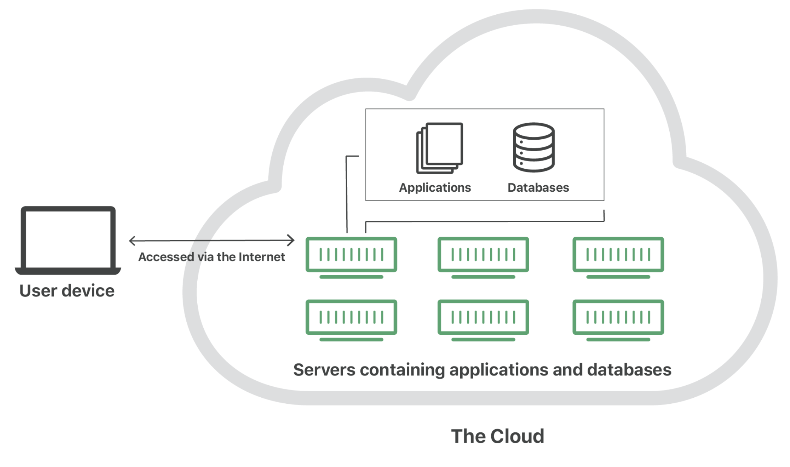
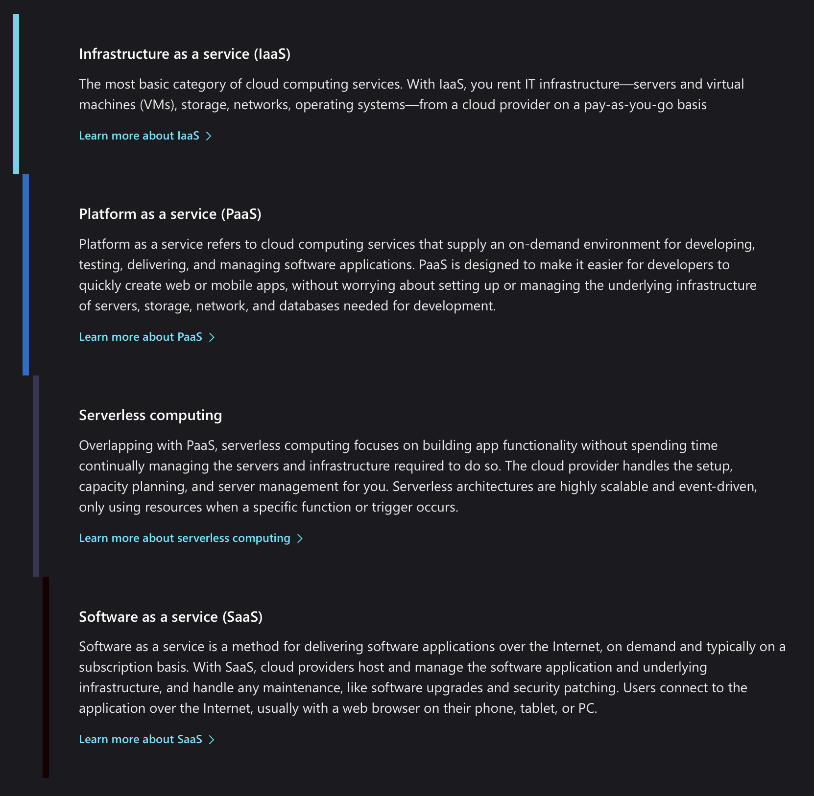
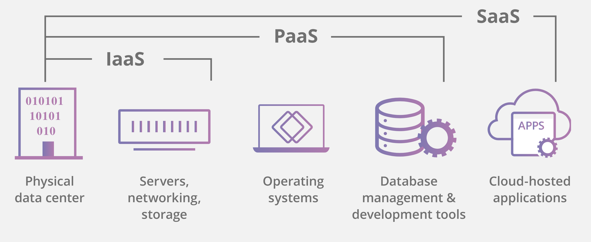
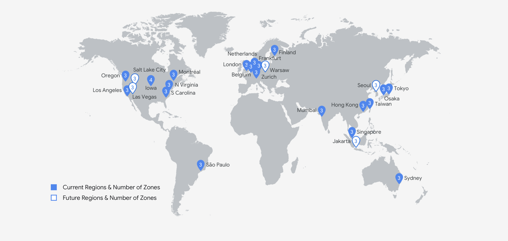
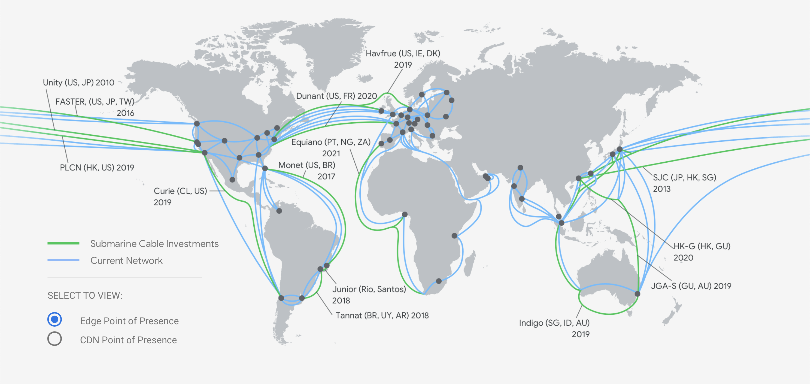

# What is the cloud? Part 1 of Cloud Developer Basics using Google Cloud Platform

_It's no longer enough to only think of development as either frontend or backend work—it's all about having a wider, more rounded competency. Right now, the public cloud is the natural spot from which to grow one's skills as it envelopes many of the ways-of-working and types of products you will want to be proficient in, when levelling up your know-how. This mini-course will take you through some of the most important concepts and services, always ending with you setting up actual micro projects._

_This course is written as part of the internal skill development initiative at Humblebee, but we share it since there is a great demand for these skills. Want to work with a cloud-savvy company that naturally marries tech and design (as in UX, service, business and visual), or just plain old want to work here at Humblebee? [Get in touch](mailto:mikael.vesavuori@humblebee.se)!_

This mini-course is divided into six parts:

1. What is the cloud?
2. Virtual machines and networking
3. Container
4. Serverless and APIs
5. Storage and databases
6. DevOps

Before we begin, a few words about me. I'm [Mikael Vesavuori](https://mikaelvesavuori.se), a Google Cloud-certified Professional Cloud Architect who loves what the public cloud can help us achieve, regardless of job title. I've worked with clients such as the [Volvo](https://www.volvo.com/home.html) companies, [Hultafors Group](http://www.hultaforsgroup.com), and most recently [Polestar](https://www.polestar.com) who are setting up a completely new architecture from the ground up.

Source code to follow along is available at [https://github.com/mikaelvesavuori/cloud-developer-basics](https://github.com/mikaelvesavuori/cloud-developer-basics).

_This mini-course is not sponsored or connected to Google, other than us using their services._

---

## Learning objectives and services covered

After following along in the theoretical and practical parts, you will have an introductory sense of the key functionalities of Google Cloud Platform, as well as some first-hand experience in running a tiny serverless application.

Services covered:

- Cloud Storage
- Cloud Functions
- Firebase Realtime Database
- IAM (Identity & Access Management)
- Stackdriver

## Cloud evolution

What began as the contemporary _public cloud_ less than 15 years ago, has continuously grown in capacity as well as capability, yet has become both easier to manage or work with, and offers more bang for the buck today than it did back then.

To quote [Wikipedia](https://en.wikipedia.org/wiki/Cloud_computing), "Cloud computing is the on-demand availability of computer system resources", which most easily translates into web sites or services being provided, with all their requisite network connectivity, storage (files, code, data) and processing power (i.e. render a web page).


_Image from Cloudflare (https://www.cloudflare.com/learning/cloud/what-is-the-cloud/)_

Over time, providers like Microsoft, Google, and Amazon Web Services have increased their managed offers. What is today called _bare metal_, meaning you basically just rent a regular computer, has evolved all the way to _serverless_, which requires no management or specialist competency to set up and run. The steps of abstraction, [as listed by Microsoft](https://azure.microsoft.com/en-us/overview/what-is-cloud-computing/), follow this outline:

- Infrastructure-as-a-service
- Platform-as-a-service
- Serverless
- Software-as-a-service


_Image from Microsoft (https://azure.microsoft.com/en-us/overview/what-is-cloud-computing/)_

It's important to understand that that "evolution" means less in terms of "later means better", and more about operational concerns regarding the type of skills and investment you want to make and reqwuirements you might have on operating and possibly owning the deeper layers. While a classic Infrastructure-as-a-service architecture might have its perfect cases still, the benefits of going serverless for example means that you can almost immediately put things in "production mode" across the world, but only by giving up a degree of control to gain that speed.


_Image from Cloudflare (https://www.cloudflare.com/learning/cloud/what-is-the-cloud/)_

## What is the Cloud?

While a cloud provider may have hundreds of services or offerings, they are usually really confined to a small set of bigger areas.

### Compute

Computers gotta compute. Regardless if you need a firecracker or a planet-buster when it comes to capacity, there is a compute model and compute size for you.

### Storage

Storage is getting more important as architectures are getting more stateless and your events have to reside somewhere. Exists as actual disks to in-memory caches.

### Network

Traffic has to run back and forth into your applications. While much heavy lifting is done, lots of it is now virtualized and has to somehow be handled on your end as well.

### Databases

Any variety of databases: zonal, global, relational or non-relational, serverful or serverless, document-oriented or whatever… There’s something for your use-case.

### Provided apps & APIs

Ready-to-consume applications, services and APIs such as Cloud Vision.

## Concepts

The following concepts will be briefly touched upon.

- Scalability
- Elasticity
- Durability
- Availability
- Regions and zones
- Virtualization
- Public/private/hybrid
- Operational expenditure

### Scalability

The classic problem area that cloud can solve easily, which happens by scaling out (adding more resources) or scaling up (adding more powerful resources). This is traditionally done manually or by providing scaling thresholds. Scalability is important when we get more load or traffic.

### Elasticity

Similar to scalability, but offers the factor of dynamically allocating resources without any additional manual labor. Having this managed reduces a great deal of manual overhead and greatly minimizes the need to preemptively expect high (or low) loads.

### Durability

The measure of how resistent a record is against data loss and data corruption. Mostly used within the context of storage. Is often very high, such as 99.999999999% (11 9’s) meaning it’s highly unlikely that you will lose data.

### Availability

Yet another classical area – how does one ensure that the application is always available? On top of this, the term high availability (HA) is added, meaning any practice that ensures that availability is always guaranteed, by means such as replicating data or applications over several regions.

### Regions and zones

Despite the heavy use of ”cloud”, it’s all really very physical. You still depend on actual data centers running hardware, with cables looping around the world. In GCP, regions are the bigger areas, all split into some number of zones. For high availability, you want to use more than one region.


_Image from Google (https://cloud.google.com/about/locations/)_


_Image from Google (https://cloud.google.com/about/locations/)_

### Virtualization

Without virtualization there would be no cloud. Virtualization is the means of emulating hardware/software/storage with another tool, such as splitting a powerful computer into hundreds of smaller ones. This practice is most apparent within the context of compute.

### Public/private/hybrid cloud

GCP, AWS and Azure are all public clouds, meaning you share resources from the vendor. A private cloud is something you own and run on your own. A hybrid is a mix of the two. Private clouds can for example be meaningful when you require very heavy security protocols.

### Operational expenditure

Public clouds are promoting a financial model that is very dissimilar to traditional _capital expenditure_ models. They profit from your increased usage rather than licensing fees. This means that a project has a markedly different economic character than ”pre-cloud”: it’s very cheap to start, but you need to be aware of your usage to benefit fully from this situation.

## Workshop

In this rapid-fire workshop you will get a first taste of Google Cloud Platform, its interface and then go on to create a simple static-hosted website in a storage bucket, running a serverless backend function and saving user input into a serverless realtime database. You will also have set up a secure, least-privilege service account that handles your backend.

### Step 1: Set up Google Cloud account (or log in)

If you are in an organization, you may need/want to do this through your Google Organization. Else, you sign up and get \$300 of usage for free. If you already have an account, just sign in!

**Optional: Install gcloud CLI tool**

Consider installing the [gcloud](https://cloud.google.com/sdk/docs/downloads-interactive) CLI tool if you want to work with GCP from your own computer.

### Step 2: Get acquainted with the views and panels

Click around and pin some services to your left-hand side navigation panel. Use the top search bar to look for services and navigate faster. Try typing in `functions`, `storage`, `api`, and `database`.

### Step 3: Try out the Cloud Shell

Open up a Cloud Shell instance. Try using it like your regular command line, drag-and-drop files into it, and test the code editor.

### Step 4: Enable APIs

Go to [APIs and services](https://console.cloud.google.com/apis/library) and enable APIs for services that are not already active:

- Firebase
- Cloud Functions
- Cloud Storage

### Step 5: Create a Firebase database

Go to [the Firebase console](https://console.firebase.google.com/u/0/) and setup your database.

- Click _Add project_
- Give it a suitable name, such as `cloud-developer-basics-{YOUR_NAME}`
- Don't add analytics for now
- Under _Get started by adding Firebase to your app_, click the angle-brackets (Web) symbol
- Give your app a suitable nickname, such as `cdb-{YOUR_NAME}`; then register the app
- You will receive a code snippet – copy the contents of `firebaseConfig` into the pre-existing similar section in `frontend/index.html`
- Go to the _Database_ tab and scroll down a bit, under _Realtime Database_ click _Create database_ – set it to test mode

### Step 6: Create a Cloud Storage bucket

Navigate to [Cloud Storage](https://console.cloud.google.com/storage).

- Give it a globally unique name and put it in a (single) region close to you, in our case `europe-west1`
- Set access to _Set permissions uniformly at bucket-level_
- Create the bucket with any other settings set to their defaults
- Don't add any files yet!

Click the box next to the bucket and then click the three dots on the right-hand side. Select _Edit bucket permissions_. Click _Add members_. Type `allUsers` in the text field and select _Storage Object Viewer_ for the role. Any files will now be publicly viewable as they become added, later.

Navigate into the bucket. Click the _Overview_ tab and **note down the _Link URL_**. The `gs://` address is the one you would need when pointing a CLI tool like `gsutil`, but it has no effect on the open web.

### Step 7: Create a service account to securely run our backend

We are soon going to create a backend function. For security's sake we will preemptively create a service account (a programmatic user) with only the rights to invoke (run) a function, but nothing else. This is a very good security practice so it makes sense to learn it already!

Go to "IAM & admin", and into the panel _Service accounts_. Create a new service account, and give it a suitable rememberable name. For the role, give it _Cloud Functions Invoker_. This ensures it can only call functions, nothing else.

Later, when you want to use a service account programmatically, you will probably want to download the credential set in JSON format. This time, though, you don't need it.

### Step 8: Create a serverless backend with Cloud Functions

Navigate to [Cloud Functions](https://console.cloud.google.com/functions). Click "Create function".

I have supplied several test functions that you can find in the folder `/demo-cloud-functions`. Try these out first! Get familiarized with the test panel as well. This will however not be the way you do deployments and function triggering in the future, but it's a small handy tool for now. Later you will want to use something like [Insomnia](https://insomnia.rest) or [Postman](https://www.getpostman.com) to try out your functions and APIs.

When you feel ready to deploy our `getContent` function (needed to continue with the next steps), go ahead and:

- Create a new function
- Set timeout to 10 seconds as you don't want a serverless function to run for very long
- Ensure that _Name_ and _Function to execute_ are set to `getContent`, and that _Region_ is set to `europe-west1` under _Advanced options_
- Choose `Node.js 10`
- For _Service account_, point to the account that you created in the last step

Please note that the `getContent` function is set up to fetch content from DatoCMS. When you read this at some point in the future, this particular token and/or DatoCMS project may no longer be valid. To replicate the same circumstances, then in DatoCMS you would:

1. Create a model called _article_ with a single-line string named _peptext_
2. Add an instance of _article_ with the text content "My name is {{NAME}} and I'm going to be a kickass Cloud Ninja!".

If you completely want to skip the CMS, just return that text string from the function.

Copy-paste the code in `backend/index.js` into the view. Do the same for `backend/package.json`. Try running it with the following payload:

```
{
	"name": "SomeName Nameson"
}
```

Before you continue, make sure to **note the function's endpoint URL**.

### Step 9: Update index.html

In `index.html`, update the endpoint path (`const ENDPOINT`) and the image URL (`background: url({URL_PATH})`) to your own values.

### Step 10: Upload frontend files into bucket and visit the page

Go to [Cloud Storage](https://console.cloud.google.com/storage) and navigate into your bucket.

Drag-and-drop `frontend/index.html` and `frontend/humblebee.jpg` into the bucket. There should now be a symbol and text indicating that the files are public. Click the "link" symbol. The page should now display together with the background image.

### Step 11: View logs

Navigate to [Stackdriver logging](https://console.cloud.google.com/logs/). Filter for the function called `getContent`. Witness the glory of having a centralized nice-looking surface that gives you a peek under the almighty cloud hood.

And with this, you are done! Give yourself a pat on the shoulder, you've deserved it.

## Further studies

Listed here are recommended additional resources and tasks to improve your understanding and build up your foundational experience.

### Explore more

- Use Firebase more, and attempt doing the classic CRUD actions (create, read, update, delete)
- Try writing more complex functions, by sending in parameters (available under `request.body`)
- Connect services like [Cloud Vision](https://cloud.google.com/vision/docs/quickstart-client-libraries) to your Cloud Functions
- You may want to bookmark this [free Coursera course](https://www.coursera.org/learn/preparing-cloud-associate-cloud-engineer-exam) if you are looking to get the ACE certification

### References

- [Google Cloud Platform Overview](https://cloud.google.com/docs/overview/)
- [Getting Started with Google Cloud Platform](https://cloud.google.com/gcp/getting-started/)
- [An Introduction to GCP for Students](https://youtu.be/JtUIQz_EkUw?t=1384)
- [Cloud computing terms](https://azure.microsoft.com/en-us/overview/cloud-computing-dictionary/)
- [What is cloud computing? A beginner’s guide](https://azure.microsoft.com/en-us/overview/what-is-cloud-computing/)
- [HTTP Functions](https://cloud.google.com/functions/docs/writing/http)
- [What Is the Cloud? | Cloud Definition](https://www.cloudflare.com/learning/cloud/what-is-the-cloud/)
- [Structure Your Database](https://firebase.google.com/docs/database/web/structure-data)
- [Qwiklabs Quest Preview - Baseline: Infrastructure](https://www.youtube.com/watch?v=r4FEbwvs-ek&feature=youtu.be)
- [Don't get pwned: practicing the principle of least privilege](https://cloud.google.com/blog/products/identity-security/dont-get-pwned-practicing-the-principle-of-least-privilege)

### Qwiklabs

Qwiklabs are short and highly concrete lab-style tutorials. You need a free account to view them. To fully use these you need a paid membership – it should be possible to follow along and work your way through them on the free account though since the paid membership usually only adds the sandbox environment.

- [Quest: GCP Essentials](https://www.qwiklabs.com/quests/23)
- [Quest: Cloud Development](https://www.qwiklabs.com/quests/67)
- [Quest: Using the Cloud SDK Command Line](https://www.qwiklabs.com/quests/95)
- [Quest: Baseline: Infrastructure](https://www.qwiklabs.com/quests/33)
- [Quest: Security & Identity Fundamentals](https://www.qwiklabs.com/quests/40)
