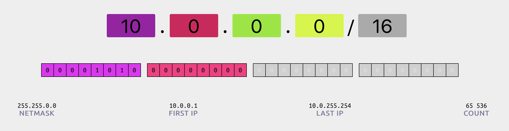
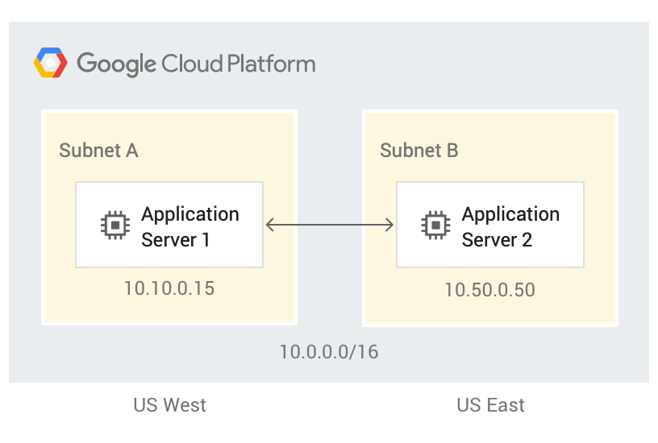
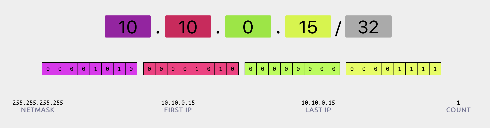
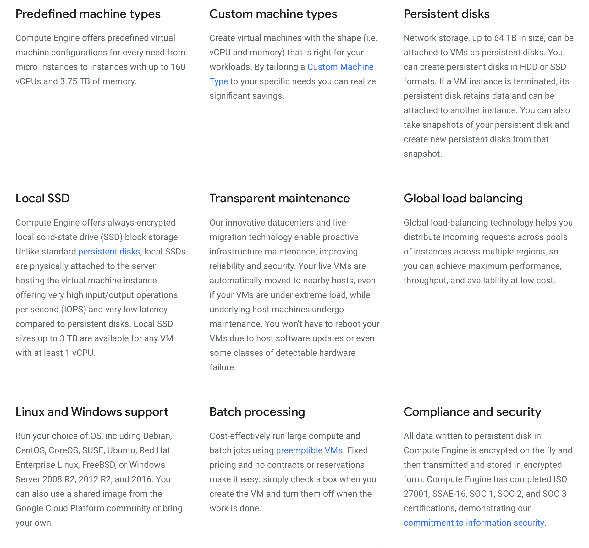
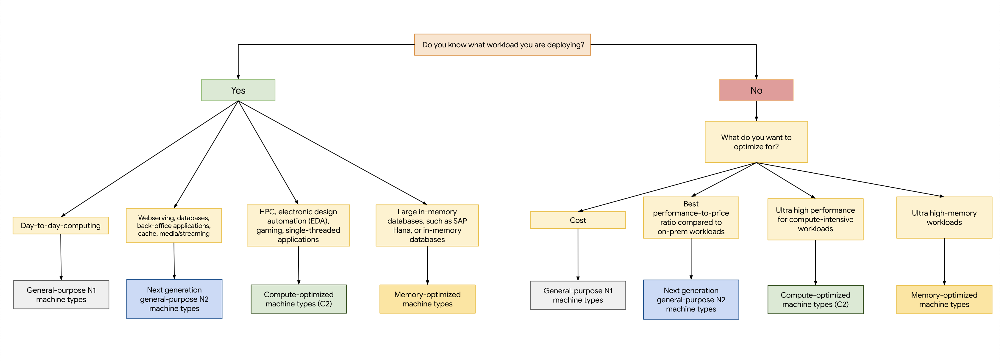

# Virtual machines and networking

## Part 2 of Cloud Developer Basics using Google Cloud Platform

_It's no longer enough to only think of development as either frontend or backend work—it's all about having a wider, more rounded competency. Right now, the public cloud is the natural spot from which to grow one's skills as it envelopes many of the ways-of-working and types of products you will want to be proficient in, when levelling up your know-how. This mini-course will take you through some of the most important concepts and services, always ending with you setting up actual micro projects._

_This course is written as part of the internal skill development initiative at Humblebee, but we share it since there is a great demand for these skills. Want to work with a cloud-savvy company that naturally marries tech and design (as in UX, service, business and visual), or just plain old want to work here at Humblebee? [Get in touch](mailto:mikael.vesavuori@humblebee.se)!_

This mini-course is divided into six parts:

1. What is the cloud?
2. Virtual machines and networking
3. Container
4. Serverless and APIs
5. Storage and databases
6. DevOps

Before we begin, a few words about me. I'm [Mikael Vesavuori](https://mikaelvesavuori.se), a Google Cloud-certified Professional Cloud Architect who loves what the public cloud can help us achieve, regardless of job title. I've worked with clients such as the [Volvo](https://www.volvo.com/home.html) companies, [Hultafors Group](http://www.hultaforsgroup.com), and most recently [Polestar](https://www.polestar.com) who are setting up a completely new architecture from the ground up.

Source code to follow along is available at [https://github.com/mikaelvesavuori/cloud-developer-basics](https://github.com/mikaelvesavuori/cloud-developer-basics).

_This mini-course is not sponsored by or in any way connected to Google, other than us using their services._

---

## Learning objectives and services covered

At the end of this session you will have enough understanding and know-how to set up an application using App Engine and Compute Engine, you will understand the central concerns of virtualization, and you will be able to provision a VPC with firewall rules to secure your instance.

Services covered:

- App Engine
- Compute Engine
- VPC

## Virtualization is the core of the cloud...

Without virtualization there would be no cloud. Virtualization is the means of emulating hardware/software/storage with another tool, such as splitting a powerful computer into hundreds of smaller ones. This practice is most apparent within the context of compute.

As you learned in the last session, there are several models for how cloud services are made available to you as a user/customer:

- Infrastructure-as-a-service,
- Platform-as-a-service,
- Serverless,
- Software-as-a-service, and so on.

Virtualization as a technology is not bound to the service model. Instead, it's bound to factors such as how long-living (persistent) the instance is. In this session we will work a bit with the two "classic" models, IAAS and PAAS.

Both offer a high degree of flexibility and persistence, with GCE being billed by the second and GAE billed on an hourly basis. They offer a free tier as well. These types of products offer a somewhat wide scope of configuration possibilities, meaning you will have to choose a machine type. A higher-configuration machine type will allow greater performance, but for a higher cost. Sometimes you may want to go higher in performance to allow yourself to use fewer instances, and in some cases it's smart to use a higher number of small machines for offloading purposes. Both GAE and GCE offer a high degree of flexibility and persistence, with GCE being billed by the second and GAE billed on an per-second or per-hour basis. GCE is covered to a small part within Google's free tier as well.

### ...but no virtualization without networking

Virtual resources, like machine instances, need IP addresses and ways of communicating in between them. In the cloud, this is managed with VPCs: Virtual Private Clouds. A VPC groups resources and provides unique IPs. The IPs follow CIDR notation, resulting in patterns such as giving the main network a range of `10.0.0.0/16` (65536 addresses minus a few Google-reserved ones).


_CIDR block for a large network. Screenshot from CIDR.xyz (http://www.cidr.xyz)_


_Connecting two subnets inside a larger network. Screenshot from Google (https://cloud.google.com/vpc/)_

When you require a finer encapsulation of groups into for example a range of IPs per office or per department, the big groups can be easily divided into smaller subnetworks. The above IP range could then be carved out, for example using `10.10.0.0/24`, to provide a space of 256 unique IPs to your office. Google Cloud Platform is pretty nifty in that anything in the VPC is global, rather than regional, which can cut down on overhead and managing cross-region connectivity. VPCs also allow you to connect to pre-existing physical networks if you need that.


_CIDR for an individual address. Screenshot from CIDR.xyz (http://www.cidr.xyz)_

On top of the networks you will want to add security measures—In GCP these are called `firewall rules`. With them comes the possibility to granularly allow or deny ingress or egress (incoming or outgoing) data according to their source and/or target IP, IP range, and tagging.

### Compute Engine: Infrastructure-as-a-service


_Compute Engine features. Screenshot from Google (https://cloud.google.com/compute/)_

The short way of summarizing Compute Engine is that it is veeeeeeeeery flexible. In the end, a GCE instance is very little less than a regular computer (minus of course the fact that the instance is virtual, maintained and sandboxed to some degree, etc etc), so you can pretty much do anything on it that you would on your own computer. Personally I have not done any high-performance jobs on one, but this is where you'd go for those concerns. Where I find Compute Engine to have its magic is when you need an actual computer and you have a wider scale of tasks to do. In that case a regular `n1-standard-1` or even the free `f1-micro` is going to get you a long way.

### App Engine: Platform-as-a-service


_App Engine features. Screenshot from Google (https://cloud.google.com/appengine/)_

I am putting App Engine in the PAAS category, even though Google brands it as serverless. I do this because of historical reasons, as contenders like [Heroku](https://www.heroku.com) and [DigitalOcean](https://www.digitalocean.com) have been offering similar services since way back when PAAS was the "big" thing.

App Engine is fully managed, and can auto-scale based on usage, and can do so according to your own policy if you want it to max out, for example, at a reasonable cost/performance point. It's also very easy to do things like A/B testing, splitting, and monitoring with GAE. At the end of the day, you only have to specify an instance type and that would suffice for App Engine, who would bring you on an absolutely honey moon but with less of the feeling of being completely broke at the end (as long as you DO specify a maximum for scaling).

**Standard vs Flex**
[App Engine offers two environments with a range of differences](https://cloud.google.com/appengine/docs/the-appengine-environments). You would probably do good to stick with standard if you are using a supported runtime and expect bursty patterns of no/low and high volume traffic. It's also likely cheaper in most cases. The Flex environment, however, offers greater degree of freedom in that you can mount Docker images with any language in it, and directly use Compute Engine resources.

Note that App Engine keeps multiple versions running at the same time. This is very good for flexibility and reliability [but can become very expensive if used carelessly](https://stackoverflow.com/questions/47125661/pricing-of-google-app-engine-flexible-env-a-500-lesson).

## Making a choice

You will need to consider a number of effects when choosing a model for your compute:

- **Pricing**: Per use, per-hour/second; additional costs or free inclusions available; is traffic included?
- **Persistence**: Can it be preemptible?; need to attach disk/state storage?
- **Security model**: Operating System access; who manages security, like credentials, system updates etc.?
- **How managed the solution should be**: Fully managed or entirely in your hands?
- **Requirements on networking and latency**: Are cold starts acceptable or do you need an always-on machine? VPC and custom networking? Public or open, interactions through which protocols?


_Compute Engine machine types. Screenshot from Google (https://cloud.google.com/compute/docs/machine-types)_

Check the [pricing calculator](https://cloud.google.com/products/calculator/) to get details and cost estimates.

## Concepts

The following concepts will be briefly touched upon.

- Instance & tenamcy
- Machine type
- Preemptibility
- VPC (Virtual Private Cloud) and networking
- Subnet/subnetwork
- Reservations/reserved instances
- VPN (Virtual Private Network)
- Network service tiers (Premium or Standard)

### Instance & tenancy

The individual machine entity. Instances are most usually multi-tenant, which means you would share hardware with other users.

### Machine type

This describes the hardware and performance of the machine instance. They are grouped under certain categories, like _General purpose_ and _Memory optimized_. It's important for cost and performance to make a considered choice when deciding on a machine type.

### Preemptibility

You can use preemptible instances which are much cheaper than normal ones. They may not always be available; will remain for max 24 hours; and can be shut down at any time. These are good for error-tolerant workloads.

### VPC (Virtual Private Cloud) and networking

Networking within GCP is completely virtual, since what you do is actually to set up virtual configurations for incoming and outgoing traffic. The grand picture includes VPC networks as global resources, which you can subdivide into regional subnetworks (the ones you actually assign to your own resources), and then you can further control traffic with firewall rules. You can extend VPC even into on-premises systems.

### Subnet/subnetwork

A smaller division of a bigger network (in Google Cloud, a VPC network). This is what you use to segment the network.

### Reservations/reserved instances

A reserved instance is one you commit to, rather than using it on-demand. Reservations are cheaper but you are tied to them. This is a great choice when you have expect a highly predictable workload.

### VPN (Virtual Private Network)

VPN is a way to securely connect networks, by encrypting traffic in one end and decrypting it in the other.

### Network service tiers

Premium or Standard variants. Google offers to handle your traffic within its own infrastructure. This will mean it is faster and more secure than hopping into the public internet via transit ISPs. Some functionality requires the Premium tier.

## Workshop

We are going to run a webserver in both the serverless/PAAS offering App Engine (using Standard and Flex modes) as well as in the IAAS offering Compute Engine. We will end with a brief exercise in configuring a basic setup with a public and a private instance.

### Step 1: Clone the `node-simple-webserver` repo

We are going to use a small application, [node-simple-webserver](https://github.com/mikaelvesavuori/node-simple-webserver) for the duration of this workshop. Go ahead and clone it to your computer.

### Step 2: Install `gcloud` CLI tool or update them

Install the [gcloud](https://cloud.google.com/sdk/docs/downloads-interactive) CLI tool so you can work with Google Cloud Platform from your own computer. If you have them installed, update them with `gcloud components update`.

### Step 3: Enable APIs

Go to [APIs and services](https://console.cloud.google.com/apis/library) and enable APIs for services that may not already be active:

- App Engine Admin API
- Compute Engine API

### Step 4: App Engine (Flex)

The Flex environment gives a fair bit of...well...flexibility, but also adds some work on your end. It is however very convenient in that it accepts using Docker images to specify how to bundle your application.

_We will deploy the webserver to App Engine according to the Dockerfile present in the webserver folder. Don't worry if you are new to Docker, we will learn more in the next workshop. For App Engine to work, you need to have a configuration/definition file._

Copy `gae/flex/app.yaml` into the root of the webserver folder. Now, run `gcloud app deploy` and answer "yes" to the question that you're prompted with. Wait for a few minutes as the version gets deployed.

You should see the webserver working. Try to go to `{URL}/hello` to see another type of response.

### Step 5: App Engine (Standard)

_This time we will use the "easy", regular way of using App Engine. We'll take care of the app structure first._

Inside of the webserver source code, drag the two files in `/src` into the root. Copy `gae/standard/app.yaml` from this repo (Cloud Developers Basics) into the webserver's root folder, replacing the old `app.yaml` file.

We also need to do a minor code change to make the change more visible. In `app/index.js`, update the `reply.send()` block to return the below markup.

```
<html><head><title>Simple Node.js webserver</title></head><body><p>Simple Node.js webserver that has cats!</p></body></html>
```

After making the above changes, run `gcloud app deploy` from the root folder again. When it's done, run `gcloud app browse` to launch the application in your default browser. Make sure it still works. As you visit your URL, you'll see the most recent version (the one with the cat image).

### Step 6: App Engine Dashboard and settings

In the [Dashboard](https://console.cloud.google.com/appengine) view you will find an overview of what's going on with your application, such as errors, traffic and billing status.

### Step 7: Set up a firewall rule to block yourself

Search Google (or whatever search engine you prefer) for "what is my ip" and you should get back your IP address; else follow relevant links to services that help you get it. Now go to [Firewall rules](https://console.cloud.google.com/appengine/firewall) and click _Create rule_. Let the rule have priority 100 (priorities are by convention in increments of a hundred, and lower values equal higher priority). the action should be "Deny" and "IP range" should be the IP you just got back. Click "Save" and try to visit the page again. It shouldn't work! Remove the rule when you are happy knowing that it's sooooo easy to lock yourself out.

### Step 8: Traffic routing

We will attempt to split traffic to the new AND the previous version. In the [Versions](https://console.cloud.google.com/appengine/versions) view, click the boxes of the two most recent versions and the select _Split traffic_. Select splitting by _Random_ and adjust traffic for a 50/50 split, then save. Once again, visit your URL, reloading a few times, and you should see that about half of all reloads use the new variant. Great for split testing or doing slow, controlled rollouts!

### Step 9: Shut down the GAE application

Go to [Settings](https://console.cloud.google.com/appengine/settings). Click _Disable application_; confirm the prompt. Shutting down will take a few seconds.

### Step 10: Creating a Google Compute Engine instance

Go to [Compute Engine](https://console.cloud.google.com/compute/instances). Click _Create_.

While it's almost free to have a small VM up for the duration of this workshop, you should probably already learn that you get to run one (very small) instance for free for the duration of an entire month. That instance type is called `f1-micro`.

Give the instance a meaningful name, such as `gce-demo-manual`. You will find that you need to specify both region AND a zone, which you haven't needed to do for other services in this course. Choose a nearby region, which for us means `europe-west1`. Any zone will do. Machine type should be the previously mentioned `f1-micro`.

Leave everything as it is, except `Allow HTTP traffic` and `Allow HTTPS traffic` which you should enable.

Make sure to pop out the `Management, security, disks, networking, sole tenancy` tab at the bottom before you move on. Take a gander at some of the options available. No need for changes at the moment, but get used to the wording and options for a few seconds. Click _Create_.

### Step 11: Create a GCE web server with a startup script

Now try doing what you just did, but add a startup script that will run when the machine starts/reboots. The only difference, beyond giving it a new name, is that you need to open the `Management, security, disks, networking, sole tenancy` section, go to "Startup script" and copy-paste the contents of `gce/startup-script-webserver.sh`. With that only change, create it.

Look for your external URL when the machine has completed its boot-up. If it works, you should see a bit of HTML being rendered.

### Bonus: Accessing private VM from public VM

Finally, we will do a dumb little demo where a private computer will serve a website. It will only be accessible to a public instance.

Begin by creating a VM called "instance-public". Set "Firewall" to allow HTTP traffic. Open the `Management, security, disks, networking, sole tenancy` menu. Select the "Networking" tab. Click _Create_.

Now for a private machine. Create a new VM, name it "instance-private". Use the same region you used for the public machine. Set it to a `f1-micro` machine type. _DO NOT SET_ allow HTTP traffic. Under the `Management, security, disks, networking, sole tenancy` section, go to "Startup script" and copy-paste the contents of `gce/startup-script-webserver.sh`. Next, navigate to the `Networking` tab. Click the box under "Network interface", then switch "External IP" to `None`. Create the machine.

With that finished, you should see both machines listed in the Compute Engine view. SSH into the public machine. Run `curl instance-private`. It should return the HTML successfully. Notice how you were able to successfully communicate with the private machine by its readable name, rather than using an IP.

This is just a very short preview of how you could apply some practical networking. I highly recommend that you look into the linked resources and do testing of your own, especially with multiple VPCs.

## Further studies

Listed here are recommended additional resources and tasks to improve your understanding and build up your foundational experience.

### Explore more

- Go to [VPC Networks](https://console.cloud.google.com/networking/networks/list) and create your own networks and subnets; then start placing machines in them. Try to see what happens if you have machines in different networks.
- Set up a Compute Engine instance template and toy around with it. It's a neat way of creating similar (though individual) replicas of a configuration. You can also string them together as a Managed Instance Group which adds several scaling benefits like load balancing, auto-healing, and auto-scaling. There is a script ready to use in `gcloud` or in the Cloud Shell, located at `gce/instance-from-instance-template.sh`. See below for more references and links regarding instance groups and templates.

### References

- [Introduction to Virtual Machines, Cloud Next '19](https://www.youtube.com/watch?v=3aNDcgoJ-_8)

**App Engine**

- [App Engine](https://cloud.google.com/appengine/)
- [Building a Node.js App on App Engine](https://cloud.google.com/appengine/docs/standard/nodejs/building-app/)
- [Choosing an App Engine environment](https://cloud.google.com/appengine/docs/the-appengine-environments)

**Compute Engine**

- [Compute Engine](https://cloud.google.com/compute/)
- [5 Steps to deploy Website using Google Compute Engine](https://medium.com/google-cloud/hosting-a-website-on-google-cloud-using-google-compute-engine-c6fe84d76f51)
- [Scaling Web Apps on Google Compute Engine](https://medium.com/google-cloud/scaling-web-app-on-google-compute-engine-d21d6ce3e837)
- [Machine types](https://cloud.google.com/compute/docs/machine-types)
- [Instance groups](https://cloud.google.com/compute/docs/instance-groups/)
- [Instance templates](https://cloud.google.com/compute/docs/instance-templates/)
- [Creating managed instance groups](https://cloud.google.com/compute/docs/instance-groups/creating-groups-of-managed-instances)

**Networking**

- [CIDR.xyz](http://cidr.xyz)
- [Network Service Tiers](https://cloud.google.com/network-tiers)
- [Google Codelabs: Bastion Host](https://codelabs.developers.google.com/codelabs/gcp-infra-bastion-host/index.html)
- [https://codelabs.developers.google.com/codelabs/cloud-subnetworks/index.html?index=..%2F..index#0](https://codelabs.developers.google.com/codelabs/cloud-subnetworks/index.html?index=..%2F..index#0)
- [https://codelabs.developers.google.com/codelabs/gcp-aws-custom-networks/index.html?#0](https://codelabs.developers.google.com/codelabs/gcp-aws-custom-networks/index.html?#0)
- [Virtual Private Cloud (VPC) network overview](https://cloud.google.com/vpc/docs/vpc#subnetworks_and_firewall_rules)

### Qwiklabs

Qwiklabs are short and highly concrete lab-style tutorials. You need a free account to view them. To fully use these you need a paid membership — it should be possible to follow along and work your way through them on the free account though since the paid membership usually only adds the sandbox environment.

- [Deploy Node.js Express Application in App Engine](https://www.qwiklabs.com/focuses/3340?catalog_rank=%7B%22rank%22%3A27%2C%22num_filters%22%3A0%2C%22has_search%22%3Atrue%7D&parent=catalog&search_id=3752336)
- [Running WordPress on App Engine Flexible Environment](https://www.qwiklabs.com/focuses/1138?parent=catalog)
- [Multiple VPC Networks](https://www.qwiklabs.com/focuses/1230?parent=catalog)
