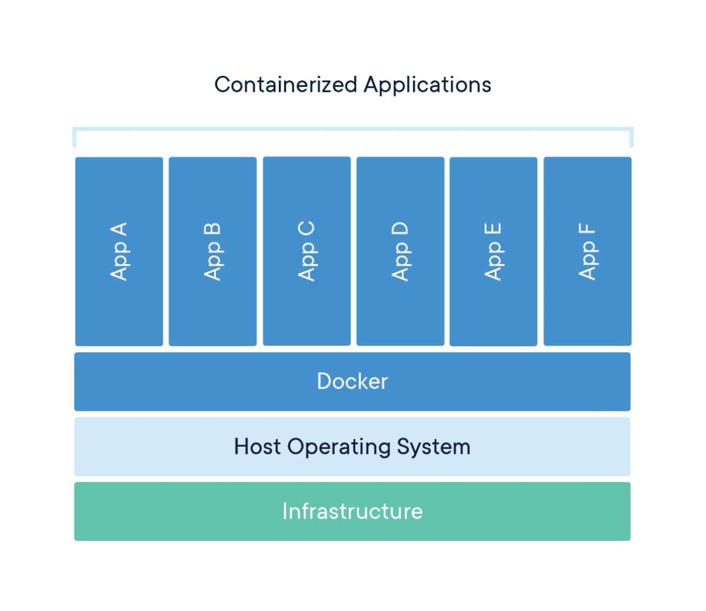
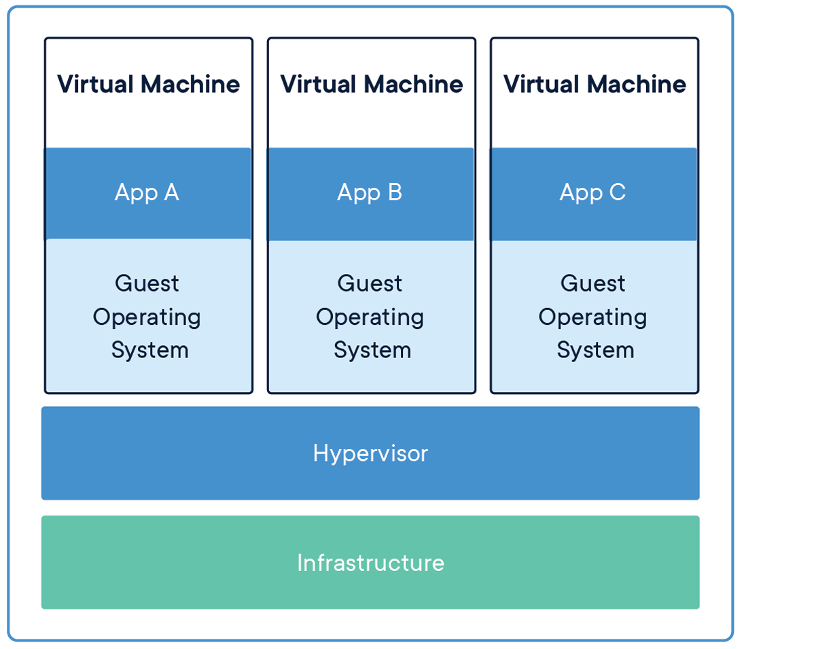
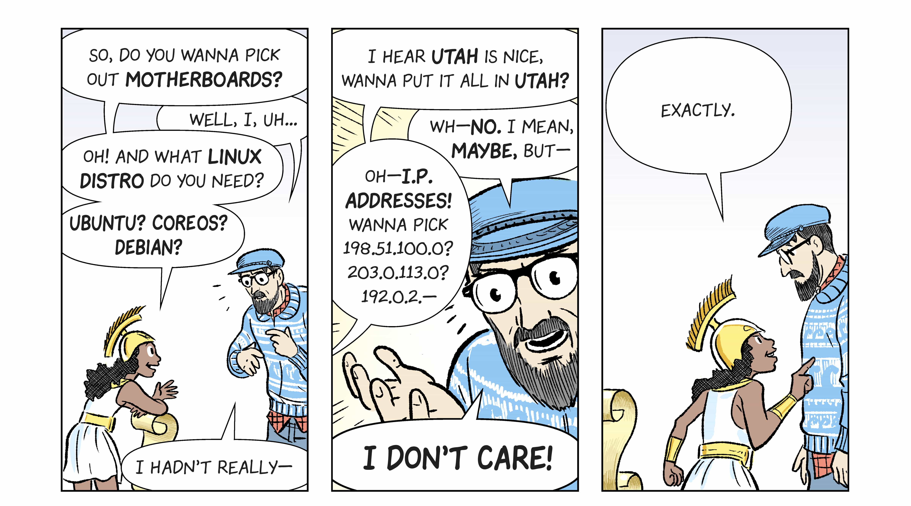
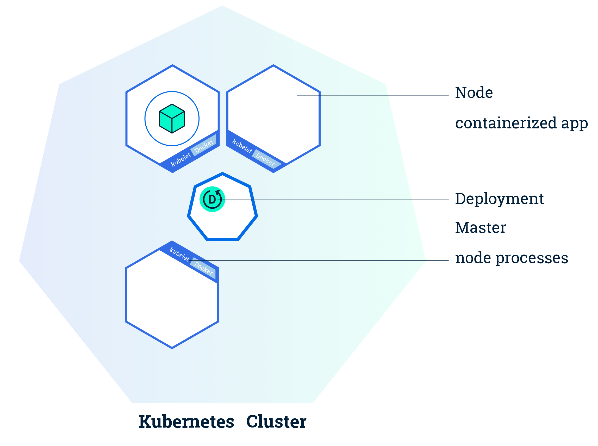
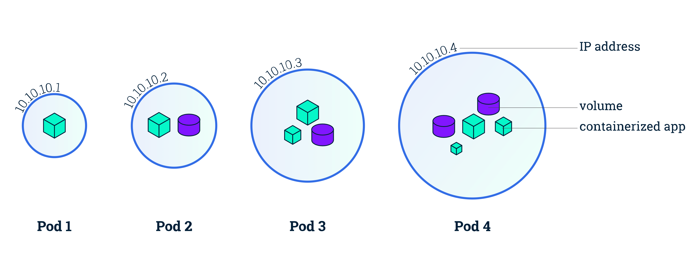
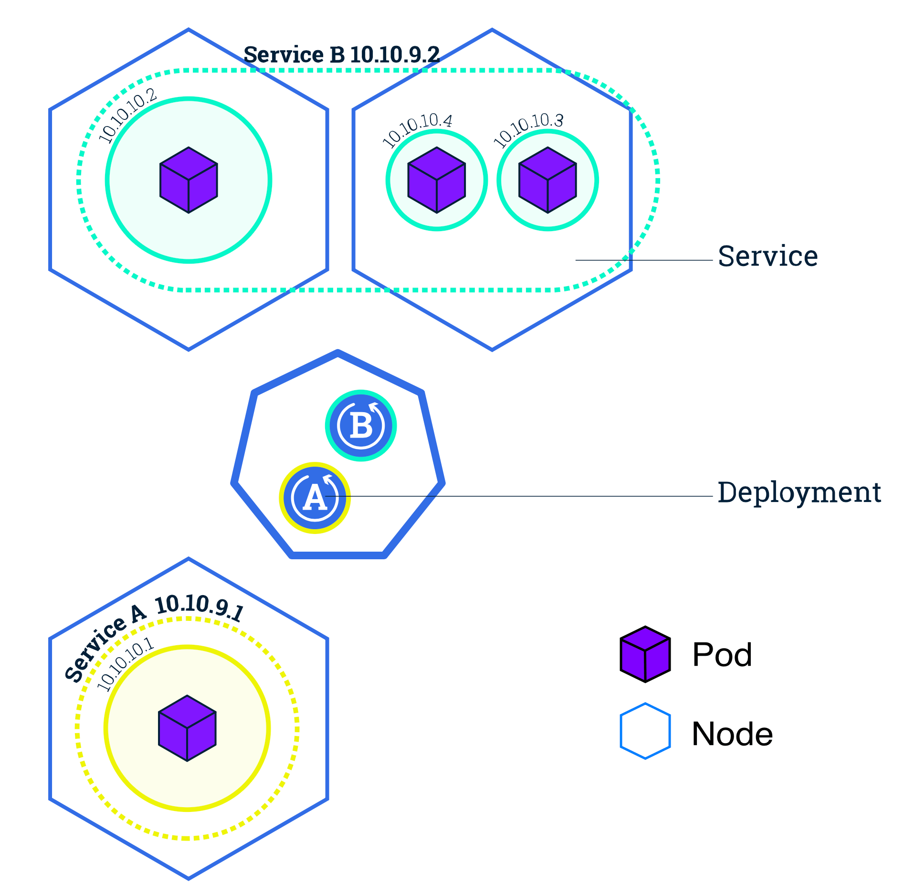
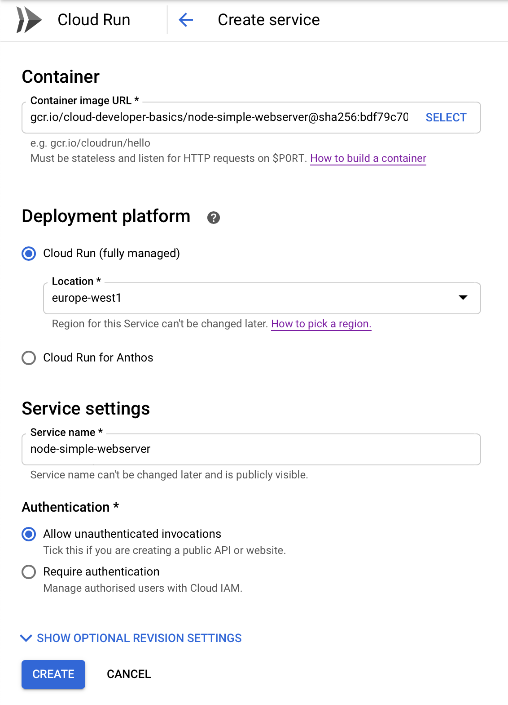

# Containers

## Part 3 of Cloud Developer Basics using Google Cloud Platform

_It's no longer enough to only think of development as either frontend or backend work—it's all about having a wider, more rounded competency. Right now, the public cloud is the natural spot from which to grow one's skills as it envelopes many of the ways-of-working and types of products you will want to be proficient in, when levelling up your know-how. This mini-course will take you through some of the most important concepts and services, always ending with you setting up actual micro projects._

_This course is written as part of the internal skill development initiative at Humblebee, but we share it since there is a great demand for these skills. Want to work with a cloud-savvy company that naturally marries tech and design (as in UX, service, business and visual), or just plain old want to work here at Humblebee? [Get in touch](mailto:mikael.vesavuori@humblebee.se)!_

This mini-course is divided into six parts:

1. What is the cloud?
2. Virtual machines and networking
3. Containers and Kubernetes
4. Serverless and APIs
5. Storage and databases
6. DevOps

Before we begin, a few words about me. I'm [Mikael Vesavuori](https://mikaelvesavuori.se), a Google Cloud-certified Professional Cloud Architect who loves what the public cloud can help us achieve, regardless of job title. I've worked with clients such as the [Volvo](https://www.volvo.com/home.html) companies, [Hultafors Group](http://www.hultaforsgroup.com), and most recently [Polestar](https://www.polestar.com) who are setting up a completely new architecture from the ground up.

Source code to follow along is available at [https://github.com/mikaelvesavuori/cloud-developer-basics](https://github.com/mikaelvesavuori/cloud-developer-basics).

_This mini-course is not sponsored by or in any way connected to Google, other than us using their services._

---

## Learning objectives and services covered

You will understand the use case for containers, have a basic understanding of microservices, and have practical experience in containerizing an application and running it within several of Google's platforms. You will be provided source code for this session, so there is no need for you to write or obtain any other code.

Services covered:

- Container Registry
- Compute Engine
- Cloud Run
- Kubernetes Engine

Beyond the above, you will also make use of Docker.

## Topic introduction and theory

Deploying and running traditional "monolithic" applications has been done for decades now. A traditional monolith has certain conveniences, such as being a single context (no immediate "outside"); they probably have a single codebase and, given a sufficiently small application, those can be a bit faster to work with, involving less boilerplate and glue code. Ergo, you can see it all and therefore control it all.

The problem of monoliths comes into play right at the moment where concerns begin to intermingle and there no longer is a clear separation of tasks, and complexity begins to swell as an effect of that. Another common problem is that deploying new code is (or is experienced) as being significantly brittle and risky. This is always a warning sign! From another perspective, it says something about human capacity that we cannot fully comprehend things that are overwhelmingly big and complex, so we should do all we can to plan things well, so we don't get into that pickle in the first place.

A way to improve the situation is therefore to minimize the quantity of tasks, maximize their individual functional efficiency, and then to separate every task into an [idempotent](https://en.wikipedia.org/wiki/Idempotence) implementation with clear and documented input/output. Doing so will significantly contain any errors, as well as offer observability into what works and what does not. When something breaks, it's highly unlikely that the complete application is broken, right? **Note**: The perspective presented here is also very, very applicable to serverless functions, a topic that will be covered more in sessions 4 and 5.

While there are ways of deploying and writing applications that are neither monolithic nor microservice-based, I will nonetheless spend my time on the microservice way for this session. Microservices provide great benefits that make sense today, and are also what likely marks the biggest difference from what you (and most developers) may have worked with up until now.

### Why containers are a big thing

Deploying small applications to a machine (virtual or otherwise) opens up the risk that the apps may conflict. With containers, we can bundle dependencies and the actual operating system into a file (an "image") which can be run autonomously. Containers made it a whole lot easier to practically produce microservice-based software, as a machine could theoretically load any number (?) of images in parallel, connecting them through local networking. The images are reproducible, easy to use, and because of their isolation, they are also safe. That's a recipe that has come to form how organizations work with deploying and running applications in the mid-10s onward.



_Images from Docker (https://www.docker.com/resources/what-container)_

Docker has become the de facto standard tool, but other tools exist. Docker is also not the first contender to provide containerization, as containerization has at minimum a couple of decades of history already.

Google Cloud Platform gives a number of alternatives for running your containers. This includes Compute Engine which you should be familiar with now. Let me present Cloud Run, one of the most recent services!

### Cloud Run

[Cloud Run](https://cloud.google.com/run/) makes it possible to run serverless containers. Serverless containers are a brilliant idea. I'll admit that I like serverless functions more than serverless containers, but the containers greatly increase the ease of transitioning typical monolith-style applications. You get what you expect from a serverless offering: auto-scaling, high availability, built-in monitoring, and an HTTPS endpoint to use right away for your Hacker News killer. More or less zero work involved. Always a good deal!

Under the hood, Cloud Run uses [Knative](https://cloud.google.com/knative/), an open API and runtime environment which is portable to other vendors that also provide Knative support. So: If you really like Cloud Run but don't want vendor lock-in, you should be able to port/move your apps with minimal effort later. You will see that it's very easy to deploy an app to Cloud Run later.

### Google Kubernetes Engine

> "Kubernetes is a production-grade, open-source platform that orchestrates the placement (scheduling) and execution of application containers within and across computer clusters."

_— From [https://kubernetes.io/docs/tutorials/kubernetes-basics/create-cluster/cluster-intro/](https://kubernetes.io/docs/tutorials/kubernetes-basics/create-cluster/cluster-intro/)_

Kubernetes solves a range of problems for certain types of users and use cases, mainly those who are active in large-scale distributed systems. It's great when you want to run a number of high-availability applications that need to know about each other (and communicate with each other) in a secure environment.

It also just happens to have a reputation of possessing a learning curve that's steep as a cheese sliced only on one side (if this reference makes no sense to you, it's because you've never lived in Scandinavia _haha_).


_How not to slice cheese. Image from ScandiKitchen (https://www.scandikitchen.co.uk/little-scandinavian-lessons-how-to-slice-cheese/)_

Where it shines is in how it abstracts away many of the concerns related to deploying and maintaining microservice-based applications. First and foremost, it uses a conceptual model based around _pods_ (group of containers) that run _nodes_ (machines). _Services_ (set of pods). One of the abstractions you will likely have great use of is _deployments_ which describe updates for Pods but also ReplicaSets. Kubernetes will handle health checks and ensure functional stability and is "self-healing" in that it will restore itself to the intended state at any time it encounters a diff or error. Automatic rollouts and rollbacks is also pretty painless. All of the heavy lifting (networking and status etc.) is done by the Control Plane which communicates from the master node to the other nodes. Pods are also aware and communicative with the overall status.


_From Google's fabulous Kubernetes learning comic (wow…that's a string of words I never though I'd write) drawn by Scott McCloud. Read it at https://cloud.google.com/kubernetes-engine/kubernetes-comic/_

Because the minimum solid number of nodes (at least in Google Kubernetes Engine) is 3, you are already from the get-go setting up a highly-available system. GKE, by virtue of being a managed solution, has a whole lot less to think about than running Kubernetes without any abstractions.




_**Cluster** (set of machines + master node handling the Kubernetes control plane) > **Nodes** (individual machines/VMs owning a set of pods) > **Pods** (contains resources and applications) > **Services** (definitions of what resources and apps belong together logically). **Deployments** specify the ideal state._

You should absolutely continue [reading up on the concepts in greater detail](https://kubernetes.io/docs/concepts/).

## Core concepts

- Monolith
- Microservice
- Container
- Cluster
- Node
- Pod
- Container
- Service

I really recommend you read the awesome comic book format intro to Kubernetes, called [Smooth Sailing with Kubernetes](https://cloud.google.com/kubernetes-engine/kubernetes-comic/), as it wraps together what you just read in a funny and succinct manner. Also, it's never bad reading up more than once on a new topic.

### Monolith

When you tie several (or all) layers of a software architecture into one, then you have a monolith. An example of a monolith could be an application that bundles logic, data, and presentation in a single package and deployment. It would then necessitate a complete deployment for a change in any given layer.

### Microservice

Microservices are "minimal", in the sense that they are small, loosely coupled, and from an implementation perspective only do as little as possible to provide a given business capability. They should be independent and if possible, be technically agnostic.

### Container

A container is a running instance of an image, which in turn is a kind of template. The container will host both an operating system as well as the intended application. It is an isolated unit that can co-exist with other containers.

### Cluster (Kubernetes)

The cluster is the grouping of machines that run the master node and the nodes with your application(s). In GKE, this is similar to setting up a managed instance group.

### Node (Kubernetes)

The node is an individual worker machine (virtual or physical) that hosts individual pods that run application(s). They are managed by their master components (or control plane).

### Pod (Kubernetes)

A pod can contain one or more applications. Containers in a Pod share IP and port, are always co-located and co-scheduled, and run in a shared context on the same Node.

### Service (Kubernetes)

The Service is an abstraction that provides a way of accessing the set of pods via IP/DNS address. This can take the shape of a NodePort, LoadBalancer or ClusterIP.

## Workshop

In this session we are going to containerize a Node application, push it to a registry for consumption, and then run the container on three different platforms: Compute Engine, Cloud Run, and Google's managed Kubernetes Engine. You should be able to get App Engine working easily as well, if you completed the last workshop.

**This time, we will also do all of our code and work within the Cloud Shell.**

If you are intent on doing this locally, you should probably also make sure to run `gcloud auth configure-docker` so that Docker works.

### Step 1: Enable Kubernetes Engine API and set up variables

Log in to Google Cloud Platform. Then go to [APIs & Services](https://console.cloud.google.com/apis/library?cloudshell=true) and enable the Kubernetes Engine API and the Cloud Run API. It

Also export a global variable to ease the use of some future commands we will run, by doing:

- `export PROJECT_ID=$(gcloud config get-value project)`
- `export APP_NAME={whatever name you want, for example webserver}`
- `export REGION={whatever region you want, for example europe-north1}`

### Step 2: Containerize an application

Open up Cloud Shell. Run `git clone https://github.com/mikaelvesavuori/node-simple-webserver.git` to clone the webserver demo, then step into it.

With Docker you build (or "containerize" your application) and then usually apply a tag to it. It's common to use 'latest' for the most recent.

Before we do that, we should change the applications's port from 8080 to 80. Do that by running `nano src/index.js` and changing the line with `await fastify.listen(8080, ...)` to use 80 instead. Save and exit by hitting CTRL+X and Y to accept the save. You should also update, in a similar manner, the port in Dockerfile to 80. Setting port 80 now is the easiest way to avoid doing any other port mappings, since Compute Engine will use the default HTTP port (which is 80). Later we will change it back to 8080.

Let's also remove some unneeded files from the repo with:

```
rm build-aws.sh
rm build-gcp.sh
rm -rf serverless
```

Next, run the command to build a tagged image: `docker build -t gcr.io/${PROJECT_ID}/${APP_NAME} .`. The dot at the end means the "target", which in this case resolves to the current directory.

When the operation is completed, run `docker images`. You should see that you now have Docker images for Node and the app itself residing on disk.

Now, you should try to run the contents of the image. Do this by typing in `docker run --rm -p 80:80 gcr.io/${PROJECT_ID}/${APP_NAME}`; it will listen for input. To launch a browser with the contents, click the _Web preview_ button in the upper right of the console. The `-p` parameter (or `--port`) allows you to map a port from an exposed port to some other one. In this case we are simply specifying port 80 to be port 80.

Also good to know is that you can see running Docker processing with `docker ps`. And when stopping, it is enough for you to only specify the first few characters of the container ID, such as `docker stop a101` if you have a container ID `a10170f0cd75`.

Tip: When you're running Docker locally, I've found `docker system prune -a` to be a good command to [forcibly remove most images and dangling references](https://docs.docker.com/engine/reference/commandline/system_prune/) collected on disk.

### Step 3: Push container to Container Registry

Google Container Registry is similar to many other such registries. They provide the possibility to host public and private containers in a similar way to Node's npm package manager, the Nuget package manager for .NET or Python's pip. As long as you have access rights you should be able to peruse a container from a registry.

Cloud Shell comes with a number of tools ready, Docker being one of them. You have the possibility of using plain Docker if you want, or use Google Cloud Build if you want to use that process. Cloud Build will be used in later sessions, but for this time let's just do it the standard way like you can do on your own computer.

Without further ado, push the container with `docker push gcr.io/${PROJECT_ID}/${APP_NAME}`. It gets uploaded in layers and those are usually cached in one way or another so the first time will take longer than subsequent pushes.

### Step 4: Take a look at your container

Go to [Container Registry](https://console.cloud.google.com/gcr/images/) and take a look at your container image, with tags and all.

### Step 5: Start a Compute Engine webserver with your new image

In Compute Engine, try to remember what you learned in the last workshop. Your goal is to configure a VM, and specify your freshly-minted image as the VM image. Check the box for _Deploy a container image to this VM instance_ in the Compute Engine creation panel, making sure to add the GCR address in the _Container image_ input box; it should look something like `gcr.io/${PROJECT_ID}/${APP_NAME}`. Help is available [here](https://cloud.google.com/compute/docs/containers/deploying-containers) if you need it.

When it's done, visit the machine's endpoint. When you see it all chugging along, take the time to stop or remove the VM as we won't use it more than this.

### Step 6: Deploy on Cloud Run

Next up: Cloud Run. A fantastic piece of technology, and very easy to use, to boot.

Cloud Run is hardcoded to use port 8080, which is important to note so that you connect your ports right. Because the demo app is a bit dumb (I have the right to say so since I wrote it, based on another very simple example _lol_) you will need to go back into `src/index.js` and `Dockerfile` to set the values to 8080 again. Upload the image with the changes before proceeding.

#### Creating a Cloud Run service through the console

Go to [Cloud Run](https://console.cloud.google.com/run) and click _Create service_. Pick a nearby location, and name it what you wish, use the managed option. For _Container image URL_, use your image URL from Container Repository. Check _Allow unauthenticated requests_, since it's a public webserver. Click _Create_.


_Cloud Run, console settings._

#### Creating a Cloud Run service through the CLI/Cloud Shell

Make sure to set your own values or variables below, then just run:

```
gcloud beta run deploy $APP_NAME \
	--image gcr.io/$PROJECT_ID/$APP_NAME:latest \
	--platform managed \
	--region $REGION \
	--allow-unauthenticated
```

Creation will take a minute or two. The script is also available in `cloud-run/deploy.sh`.

Upon successful creation, you can click the service's name to see its status and settings. You should find a URL like `https://node-webserver-demo-gktiwkghga-ew.a.run.app` where you may access the service.

### Step 7: Deploy on Kubernetes Engine

We will now set up a Kubernetes cluster running a containerized webserver. The cluster is essentially just a set of computers linked by the Kubernetes control plane to make communication between individual machines manageable. After creating the cluster, we also need to specify a deployment that gives details on what application(s) should be running on the cluster. You will also need to supply it with Docker image to mount.

#### Creating a GKE cluster through the console

In the _Clusters_ view, click _Create cluster_. Give it a meaningful name, such as `webserver-cluster`. Choose a nearby region. Go for the default _Zonal_ and leave everything else at theirs defaults, except _Machine type_ for which you might as well choose the smaller `g1-small`. While I'm a fan of `f1-micro`, those seem to fail with Kubernetes and appear to be too under-powered. You should have at least 3 nodes.

I suggest opening the bottom _Availability, networking, security and additional features_ menu to get a view of the types of concerns you may be dealing with when configuring Kubernetes. Note that for production cases you should probably go for a regional solution with nodes over more than a single zone. Since this is for pure testing that is a bit of a non-concern. Don't make any actual changes for now! When you are done, click _Create_. Wait for a few minutes while it works its magic.

Click _Deploy_ when the cluster is up. Choose an existing image and specify the URL for your image in Container Registry—you can also use the _Select_ option to show the exact images. Your URL should be in the format `gcr.io/${PROJECT_ID}/${APP_NAME}@sha256:d83dfc80dd397065b0af1d7c58961c2ace49e5a9e0419ce885253aeaf84c78ca`. Continue, and then just give the deployment a good name, like `webserver`. Deploy. Once again, wait.

We will now make the server publicly accessible. Under the _Workloads_ tab, click on your webserver. Click the button named _Expose_. Set _Port_ to 80 and _Target port_ to 8080. The first port is the publicly accessed one, and the target port should point to whatever port the continaer itself is exposing. After setting the ports, click _Expose_. Shortly there will be an Ingress service (of type "Load balancer") available that handles that traffic. Under the _Services & Ingress_ tab, look for an IP address in the _Endpoints_ column. Click it and verify that the webserver is functioning. If it's working, now append `/hello` to the URL and check if it's working. You should receive a `{"hello":"world"}` object. If all of this works, congratulations!

#### Creating a GKE cluster through the CLI/Cloud Shell

Pop out the Cloud Shell, preferably in the [Kubernetes](https://console.cloud.google.com/kubernetes/list) view. All of the Kubernetes commands can be found in `gke/commands.sh`, it's entirely possible to copy-paste all of them into the Cloud Shell. However, for reasons of clarity, we will do them one-by-one.

Create a cluster by running:

```
gcloud container clusters create ${CLUSTER_NAME} \
	--num-nodes 3 \
	--machine-type g1-small \
	--zone ${CLUSTER_ZONE}
```

It will start creating the cluster, which will take a few minutes.

Next, we will create a **deployment** using your containerized Node webserver. Do this by running `kubectl create deployment ${CLUSTER_NAME} --image=gcr.io/${PROJECT_ID}/${APP_NAME}:latest`. Edit this to use your own path. Next up, we need to open up a port for public access. This is done with `kubectl expose deployment ${CLUSTER_NAME} --type=LoadBalancer --port 80 --target-port 8080`.

Note: It's common to use manifest files that declare deployments, services and the exact configuration. Above, we've done the minimum steps manually. That will probably not be the case in a production setting.

Under the _Services & Ingress_ tab you should see an Ingress beginning to be set up for you. Ingress is a kind of meta-service that provides an abstraction for (ingoing) traffic to your cluster, as well as provisioning a HTTPS Load balancer which is going to go in front of the cluster. Having external access to the application in the cluster is more exactly what we are interested in now and Ingress makes that happen.

#### Some commands to try out

Here are some commands that you should try out before shutting down your cluster.

- `kubectl cluster-info`
- `kubectl config view`
- `kubectl get deployments`
- `kubectl get pods`
- `kubectl get services`
- `kubectl get events`
- `kubectl logs <pod-name>`

Finally... The day that you tried out Kubernetes for the first time! While I'm also a bit of a noob with K8s (as it's shortened), this should be enough for you to take your learning forward. GKE makes all of this a whole lot easier than running it fresh on your own machine. Good job!

## Further studies

Listed here are recommended additional resources and tasks to improve your understanding and build up your foundational experience.

### Explore more

- Use what you learned to pack an application of your own
- Use Docker locally, such as [Docker Desktop](https://www.docker.com/products/docker-desktop). Make sure to apply credentials to Google, in the manner of `gcloud auth configure-docker` followed by `gcloud auth login`
- Scale the cluster
- Do a ["rolling update"](https://cloud.google.com/kubernetes-engine/docs/tutorials/hello-app#step_8_deploy_a_new_version_of_your_app)
- Add a greater number of microservices, such as in this [Google demo](https://github.com/GoogleCloudPlatform/microservices-demo)

### References

**Container Registry & Docker**

- [What is a Container?](https://www.docker.com/resources/what-container)
- [Docker Desktop and Desktop Enterprise](https://www.docker.com/products/docker-desktop)
- [Quickstart for Container Registry](https://cloud.google.com/container-registry/docs/quickstart)
- [Pushing and pulling images](https://cloud.google.com/container-registry/docs/pushing-and-pulling)
- [How To Remove Docker Images, Containers, and Volumes](https://www.digitalocean.com/community/tutorials/how-to-remove-docker-images-containers-and-volumes)

**Compute Engine**

- [Deploying containers on VMs and MIGs](https://cloud.google.com/compute/docs/containers/deploying-containers)

**Cloud Run**

- [Deploying to Cloud Run](https://cloud.google.com/cloud-build/docs/deploying-builds/deploy-cloud-run)
- [Google Cloud Run - Unofficial FAQ](https://github.com/ahmetb/cloud-run-faq)

**Kubernetes**

- [Smooth Sailing with Kubernetes](https://cloud.google.com/kubernetes-engine/kubernetes-comic/)
- [Learn Kubernetes Basics](https://kubernetes.io/docs/tutorials/kubernetes-basics/)
- [Deploying a containerized web application](https://cloud.google.com/kubernetes-engine/docs/tutorials/hello-app)
- [Code Cooking: Kubernetes](https://medium.com/google-cloud/code-cooking-kubernetes-e715728a578c)
- [Kubernetes NodePort vs LoadBalancer vs Ingress? When should I use what?](https://medium.com/google-cloud/kubernetes-nodeport-vs-loadbalancer-vs-ingress-when-should-i-use-what-922f010849e0)
- [GKE Deployments with Container Builder](https://github.com/GoogleCloudPlatform/container-builder-workshop)
- [Kubernetes best practices: Resource requests and limits](https://cloud.google.com/blog/products/gcp/kubernetes-best-practices-resource-requests-and-limits)

### Qwiklabs & Codelabs

Qwiklabs are short and highly concrete lab-style tutorials. You need a free account to view them. To fully use these you need a paid membership — it should be possible to follow along and work your way through them on the free account though since the paid membership usually only adds the sandbox environment.

- [Hello Cloud Run with Node.js](https://codelabs.developers.google.com/codelabs/cloud-run-hello/#0)
- [Managing Deployments Using Kubernetes Engine](https://www.qwiklabs.com/focuses/639?parent=catalog#)
- [Deploy a Web App on GKE with HTTPS Redirect using Lets Encrypt](https://www.qwiklabs.com/focuses/2771?parent=catalog)
- [Deploying Applications Using Google Compute Engine](https://codelabs.developers.google.com/codelabs/cp100-compute-engine/)
- [Google Cloud Run Serverless Workshop](https://google.qwiklabs.com/quests/98)
