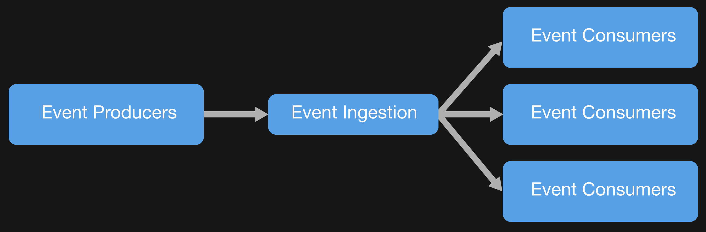

# Serverless technologies and APIs

## Part 4 of Cloud Developer Basics using Google Cloud Platform

_It's no longer enough to only think of development as either frontend or backend work—it's all about having a wider, more rounded competency. Right now, the public cloud is the natural spot from which to grow one's skills as it envelopes many of the ways-of-working and types of products you will want to be proficient in, when levelling up your know-how. This mini-course will take you through some of the most important concepts and services, always ending with you setting up actual micro projects._

_This course is written as part of the internal skill development initiative at Humblebee, but we share it since there is a great demand for these skills. Want to work with a cloud-savvy company that naturally marries tech and design (as in UX, service, business and visual), or just plain old want to work here at Humblebee? [Get in touch](mailto:mikael.vesavuori@humblebee.se)!_

This mini-course is divided into six parts:

1. What is the cloud?
2. Virtual machines and networking
3. Containers and Kubernetes
4. Serverless and APIs
5. Storage and databases
6. DevOps

Before we begin, a few words about me. I'm [Mikael Vesavuori](https://mikaelvesavuori.se), a Google Cloud-certified Professional Cloud Architect who loves what the public cloud can help us achieve, regardless of job title. I've worked with clients such as the [Volvo](https://www.volvo.com/home.html) companies, [Hultafors Group](http://www.hultaforsgroup.com), and most recently [Polestar](https://www.polestar.com) who are setting up a completely new architecture from the ground up.

Source code to follow along is available at [https://github.com/mikaelvesavuori/cloud-developer-basics](https://github.com/mikaelvesavuori/cloud-developer-basics).

_This mini-course is not sponsored by or in any way connected to Google, other than us using their services._

---

## Learning objectives and services covered

This session will give you a somewhat broad and comprehensive look at how to use [Google Cloud Functions](https://cloud.google.com/functions/) to drive a GraphQL-powered API complete with functions that work according to several different patterns: monolithic; microservice; and _message-triggered_. You will use Serverless Framework as your means of specifying your service features and as your deployment method.

Services covered:

- Cloud Functions
- Cloud Pub/Sub
- Cloud Vision API

## Topic introduction and theory

The natural evolution of infrastructure-as-a-service to platform-as-a-service may have seemed like a utopia for some. Suddenly you did not have to care about securing individual machines, or doing any acrobatics to solve high-availability scaling. But for many, even that wasn't granular, powerful, or managed enough. Since Amazon Web Services released their service [Lambda](https://aws.amazon.com/lambda/) in 2014, the concept _serverless_ has grown dramatically for each year since. Serverless technologies answer a number of interesting questions:

- Why pay per hour, when you can pay per execution?
- Why think in terms of computers, if you can think in terms of the actual compute instead?
- Why conduct your own low-level maintenance (like operating system installation and patching security vulnerabilities) if the entire platform can be standardized and trusted to be secure?
- Why require persistence if you can outsource stateful actions to a domain that already does that, such as a database?
- Why, when you think of it, provision capacity at all?

Functions-as-a-service have become nearly synonymous with serverless, yet serverless as a concept can be applied to other types of functionality/domains as well, not the least being databases, for example [Google Cloud Firestore](https://cloud.google.com/firestore/) and [AWS DynamoDB](https://aws.amazon.com/dynamodb/). We have previously looked at (and used) [Google App Engine](https://cloud.google.com/appengine/), which indeed is a serverless service. It does however most closely resemble a PaaS offering in its high-level format of specifying a machine type and the long-running nature of it.

In this session, we will look at the most recent development which has to do with individual functions instead of complete applications.

### Serverless main characteristics

There are many ways of slicing the concept "serverless" but here's some common identifiers for a serverless service:

- **Short-running**: Ideal for very short bursts, and will not run for more than a few minutes at most
- **On-demand**: Functions are ephemeral, so they don't exist/run before being called
- **Stateless**: Serverless functions do not have built-in persistence
- Their characteristics make them ideal, and **highly compatible, with microservice architecture**
- **Pay per execution**, and usually also per 100ms of used compute time
- **Managed and auto-scaling**, ideal for bursty workloads like APIs and web services

Some "negative" traits of serverless (especially functions-as-a-service) are:

- Microservices and serverless functions place a big burden on developers to be mature and stringent enough to write acceptable, "correct" services
- Can be harder to monitor depending on your setup and operations (can also be relatively easy if you go all-in)
- Impossible to figure out all potential hacking scenarios, involving for example event injection
- Almost certainly requires a complete architecture that supports serverless, else will be cumbersome and strange to work with
- Easy to get identity and access management (including permissions) wrong with serverless functions, potentially evolving into security problems
- Can be hard to stitch together stepped events if your use case cannot be covered by native cloud event sourcing
- Performance is not suitable for high-compute circumstances

Needless to say, to do "serverless" right, a team of developers with low exposure to microservices and/or serverless functions must tread carefully and think through their plan. You can't just run a traditional application architecture with FaaS if you expect it to be any good. With that said, doing them right is fantastic. You just won't get a lot faster developer velocity than with FaaS, and the minute, exact detail you can go into with monitoring and security (again, when done right) is incredible.


_Google serverless compute products. Image from Google (https://cloud.google.com/serverless-options/)._

### Event-driven architecture

Serverless functions are event-driven, meaning that they run in response to an event. An event can be that the function is simply called in a traditional way, but it can also be as the result of an event in a database, something happened on a queue, that an alarm was triggered or that a file was deleted in a bucket. This type of event sourcing is a unique aspect of the cloud. AWS offers around 50 different event sources, while Azure and GCP offer fewer. Typical event sources are changes in queues and databases, which both are perfect for web use cases.


_Typical serverless function flow. Image from Google (https://cloud.google.com/functions/)._

### Integrations

For applications and data (and anything else, technologically) to be able to communicate, we need some type of way of accessing them and then connecting those parts. An example of the most coarse-grained you can do would be to directly store data inside an application. The next step up would be to link and invoke your data layer within your presentation layer, i.e. a frontend web application directly fetches data from a database inside the same virtual machine. In both these cases (while the second is common and decidedly better than the first), you have very little separation between data and the application itself. You are "coupled".

The glue that binds your business/app logic together could be called your _integrations_: creating a way for one system to communicate with another. As you just read, an event-driven architecture can greatly simplify your work with an integration layer.

Within the world of serverless, simple queue systems have come into fashion as they decouple the events themselves, and also acts as a replayable buffer. In GCP, this is easiest solved with [Cloud Pub/Sub](https://cloud.google.com/pubsub/). The name comes from "Publish/Subscribe", because you create messages that end up in topics that a system can subscribe to. You could use an implicit trigger with a [Cloud Pub/Sub trigger](https://cloud.google.com/functions/docs/calling/pubsub) or an explicit one, such as [Cloud Tasks](https://cloud.google.com/tasks/).


_Event-driven architecture with a fan-out style event. Image from Microsoft (https://docs.microsoft.com/en-us/azure/architecture/guide/architecture-styles/event-driven)._

### Backend patterns

The basic backend patterns could be described as:

1. Deploy functions as part of a single package: gets bundled into a traditional "monolith", all in one app
2. Deploy functions as individual HTTP(S) endpoints (de facto "microservices")
3. Deploy functions that call each another (co-dependent microservices)

By some, it's seen as an anti-pattern to let one function call another. This is because individual functions should resolve into something meaningful on their own. However, the reality of business requirements is often that you have a number of complex chains of events that make sense to decompose into a chain. For that you could use [Azure Durable Functions](https://docs.microsoft.com/en-us/azure/azure-functions/durable/) or [AWS Step Functions](https://aws.amazon.com/step-functions/). Currently, Google does not have an immediate similar candidate. In those cases you would want to use a good invocation pattern to call other functions as a chain from an _orchestrator_ function, maybe adding other previously mentioned capabilities to emulate similar functionality.

### APIs: From REST to GraphQL

An API is a common way of accessing backend functionality.

When you've used ("consumed") or written APIs before, that was probably in REST. REST is a type of format that uses the basic HTTP verbs to specify what you receive from a given endpoint. Another common pattern is to specify individual endpoints per type of transaction, such as `getCustomers` or `createOrder`. The problem of the classical REST endpoints has been that you soon have a great number of endpoints that may very well do their job, but have no way of easily stitching pieces of data together, and are unable to finely specify what data you expect.

GraphQL very elegantly solves those (and other) common problems. If you have ever heard about GraphQL, it's probably precisely about the fact that it fixes the problem of under- or over-fetching data (i.e. you get or send no more and no less than asked for). A query can look like (watch closely, you'll use it later):

```
query {
  getArtworkByTitle(title: "Splotch #3") {
    artist
    imageUrl
    title
    year
    labels
    uuid
  }
}
```

Here you are doing a query ("GET"-type operation) on the resolver (function) called `getArtworkByTitle` and passing the value "Splotch #3" for the `title` parameter.


_Example of GraphQL query._

The GQL specification is open and so therefore many implementations exist. Currently the big name player is [Apollo Server](https://www.apollographql.com/docs/apollo-server/) (there's also Apollo Client for the frontend, plus some additional smaller services).

### Serverless Framework

Google's native format of specifying deployments (more exactly, cloud resources) is called [Deployment Manager](https://cloud.google.com/deployment-manager/). [Serverless Framework](https://serverless.com) is another similar tool, and is widely used to abstract those responsibilities into a somewhat more vendor-agnostic format while still virtually doing all the same things as Deployment Manager. You should know that Serverless Framework has a great deal of dependencies to its plugins which are unique per cloud vendor. Also, understand that therefore a configuration for Azure will not be immediately transferable to Google Cloud Platform. In this (and the next) session we will go with Serverless Framework because it's used enough these days to warrant that we default to its usage and because it carries skills into other clouds as well.

## Core concepts

- Serverless
- Function-as-a-service
- API
- Integration
- Microservice
- GraphQL
- Decoupling

### Serverless

A type of service offering that is usually pay-per-use, fully managed, stateless and completely on-demand. Is an evolutionary step in the IAAS-PAAS-Serverless continuum.

### Function-as-a-service

A serverless compute offering. The big names are Google Cloud Function, AWS Lambda, and Azure Functions. There's also open-source alternatives like [Fn Project](https://fnproject.io) and [OpenFaaS](https://www.openfaas.com).

### API

Application Programming Interface. Is a common way of interfacing applications with backend functionality.

### Integration

A way of making two systems interact. In the typical scenario of moving data from one place to another, for example, the integration would sync data with one shape into a more well-suited shape for the second system.

### Microservice

An independent functionality with a bounded (rigid, clear, "small") context. Should normally be maximally decoupled from any other dependencies.

### GraphQL

GraphQL is a query language initially developed by Facebook. It helps with many of the problems that especially web developers have had with REST, the last big "paradigm" before GraphQL came.

### Decoupling

Decoupling a system means ensuring that its vital parts are kept separate and with a buffer zone. An example is that you could pad a database with an API so any request to the database must pass the API. In that way you can switch the database later without breaking the interface/API for any users of the system (since that won't change).

## Workshop

In this workshop we will:

- Install [Serverless Framework](https://serverless.com), a common tool to abstract and simplify the deployment procedure around serverless stacks
- Set up a Google service account to provide credentials
- Use Serverless Framework to deploy a [GraphQL server (Apollo Server)](https://www.apollographql.com/docs/apollo-server/)
- We will also deploy a separate image recognition (labeling) service that will be used by the API (a so-called ["microservice"](https://en.wikipedia.org/wiki/Microservices))

### Step 1: Install Serverless Framework

In your CLI or terminal, install Serverless Framework globally with `yarn global add serverless` or `npm install -g serverless`.

**Note:** If you have used Serverless Framework before with other providers than Google (say, AWS), then you will know that some of them have robust support for offline testing of functions. Currently the GCP support is still somewhat rough, and you should probably accept (for now) that a lot of testing will require deploying code to try it out.

### Step 2: Clone the code for the image labeling service

Run `git clone https://github.com/mikaelvesavuori/gcp-ml-image-labeling-service`. After that, run `yarn` or `npm install` to install the API's dependencies. In my experience Yarn has previously been unreliable on Google Cloud Platform, so if you get issues delete the lockfile and `node_modules` folder, and try using `npm install` instead.

### Step 3: Create a service account (set up your GCP credentials)

Normally, Serverless Framework (SLS) will pick up your needed credentials from your environment. Pro tip: My experience using SLS for a long time, in all the big three clouds, is that for various reasons, those credentials may need to be "updated hard" sometimes.

Reminder: In Google Cloud Platform, the **Service account** is what gives you granular access to the cloud resources.

Go to _Service accounts_ under _IAM & admin_. Click the button to create a new service account. Give it a meaningful name and description. In the _Service account permissions_, specify:

- _Cloud Functions Developer_,
- _Deployment Manager Editor_, and
- _Storage Object Admin_

as the roles. You need these since Serverless Framework requires access to upload a zipped version of your function(s) to Cloud Storage; to deal with the Google-native Deployment Manager (similar functionality to Serverless Framework); as well as have rights to create/delete/update the functions themselves.

Now, click _Create key_ and download the key in JSON format.

When you've downloaded the file, place it in a secure location. The default expected location is `~/.gcloud`. When you've placed your file, open up `serverless.yml` and update the `credentials` field to use the path to your keyfile.

Best practice for security is to have minimum permissions per application: this is called the **principle of least privilege**. In a serverless functions environment it makes sense to give permissions on a per-function level. This way you can revoke rights where it makes sense, rather than doing a blanket revoke which can cause a lot of issues.

_For this session, we will reuse the same keyfile (effectively: the same service account) between both the labeling service and the API, as that cuts a bit of time—but beware that for production, you might not want to share keys/roles like that._

_Also, go to the [APIs & Services](https://console.cloud.google.com/apis/library) and enable the APIs for *Deployment Manager v2 API* and *Cloud Vision API*._

### Step 4: Deploy the labeling service with Serverless Framework

Deploying is really easy, just run `sls deploy`. Given that there are no errors, this process should take no more than maybe a minute or two.

There are a few common errors I see coming up every now and then. The most common being that `gaxios` (a nested dependency) fails. This can bizarrely be fixed by changing the service name in `serverless.yml`, making sure it does not include dashes.

### Step 5: Testing the labeling service

Do a POST request to your URL, which will look something similar to `https://europe-west1-cloud-developer-basics.cloudfunctions.net/getLabels`.

Send a payload with the body containing an `imageUrl` key with the value being the URL for an image, so it looks like this:

```
{
  "imageUrl": "https://uploads1.wikiart.org/images/giorgio-de-chirico/mystery-and-melancholy-of-a-street-1914.jpg"
}
```

Your response should come back similar to the below:

```
[
  "Architecture",
  "Illustration",
  "Visual arts",
  "Building",
  "Arch",
  "Art",
  "Arcade",
  "Facade",
  "Column",
  "Painting"
]
```

### Step 6: Clone the API repo and set up its dependencies

Run `git clone https://github.com/mikaelvesavuori/cloud-developer-basics` and step into the API folder with `cd cloud-developer-basics/04-serverless-and-apis/backend`. Next, install the dependencies with `yarn` or `npm install`.

### Step 7: Inspect the provided GraphQL API

Take a look at the API files in `/backend`, especially if you have never seen a GraphQL server before. Frankly, `api.js` isn't much magic—all of that happens in `schema.js`. Take a couple of minutes to look at `schema.js` and read the comments.

In case you are new to GraphQL, you should spend more time after the workshop [learning about its basics](https://graphql.org/learn/). The code provided should be semantic enough for now though, even if you have no previous experience. I've documented quite a bit so I hope you will gain an understanding of what's going on through those comments.

### Step 8: Deploy the API with Serverless Framework

Set up your variables in `configuration.js` and `serverless.yml`. Use the same keyfile as for the image labeling service.

Now again, run `sls deploy` to deploy the API.

### Recommended: Add the API to a REST client

I enjoy Insomnia and use it for all my REST client needs. I definitely encourage you to have a client ready-to-use to avoid hacking away with `curl` commands: it's a lot more convenient, faster, and you can keep settings for later.

### Step 9: Try using the API

Call your endpoint (something similar to `https://europe-west1-cloud-developer-basics.cloudfunctions.net/api`) and send it a GraphQL payload in this shape:

```
query {
  helloWorld
}
```

You should get back:

```
{
  "data": {
    "helloWorld": "Hello World!"
  }
}
```

**Note:** GQL payloads can absolutely be sent in regular JSON as well. In Insomnia doing a conversion would give me `{"query":"{\n helloWorld\n}"}`, while not nearly as readable, is still fully functional.

#### Get all artworks

Now try getting all artworks.

```
query {
  getArtworks {
    artist
    imageUrl
    title
    year
    labels
    uuid
  }
}
```

Remove fields and you'll see how GraphQL is nice enough to remove those for you in the response. No over-fetching!

#### Get a single artwork by title

This fetches a single artwork, based on title.

```
query {
  getArtworkByTitle(title: "Splotch #3") {
    artist
    imageUrl
    title
    year
    labels
    uuid
  }
}
```

The fields are the same as in the previous demo, so no surprises here. Remove or add fields as you want—it'll work anyway.

You will probably have noticed that you now can pass a parameter (`title`). This is how you can easily see that this is a Mutation rather than a Query.

### Step 10: Create a Cloud Pub/Sub topic and subscription

Next up, you will set up a **topic** (a message queue), **subscription** (a stream of messages from one topic), and a **trigger function** that listens (or "auto-fires") on calls to a topic of your choice.

Go to [Cloud Pub/Sub](https://console.cloud.google.com/cloudpubsub/). Click _Create topic_ and give it a name—this will need to be matched in `configuration.js`, for _Topic name_. Create it.

When it's done, click the name of the new topic. Click _Trigger Cloud Function_. Note that this can be done through Serverless Framework, but I want you to understand how this step can be manually handled. Use the source code provided, but give the function a meaningful name. The topic selector should point to the topic you made a minute ago. Click _Create_.

In the **Topics** view you should now see the new topic. Click the paperstack icon next to your topic to copy the name. Go to the **Subscriptions** panel. Click _Create subscription_. Name it something good and for _Topic name_ paste in the name of the previously-created topic (looks like `projects/${PROJECT_ID}/topics/integrationdemo`). Read through the types of config and settings you can do, but leave the rest at default values. Click _Create_.

### Step 11: Call the integration function and view the queue

This function will be a stand-in for a more common scenario, where the integration queue function is fired as a result of a user action.

```
{
  postMessageToPubSub
}
```

The response should look similar to:

```
{
  "data": {
    "postMessageToPubSub": "Message 866419159497460 published."
  }
}
```

In [Cloud Pub/Sub subscriptions view](https://console.cloud.google.com/cloudpubsub/subscription), click your subscription. Click _View messages_ in the top bar, then click _Pull_. You should be able to see your dummy message being picked up!


_Message in Cloud Pub/Sub._

Just a last step, now: Go to [Cloud Functions](https://console.cloud.google.com/functions/) and click your integration function. View its logs. This can take a few seconds, but there should soon be visible proof that your trigger knows what's going on. Now for some diabolically nifty app integrations! **muahahaha**


_Message in Stackdriver logs._

You rock! That's it for this session. Next session we will continue using this foundation by, among other things, adding a database.

## Further studies

Listed here are recommended additional resources and tasks to improve your understanding and build up your foundational experience.

### Explore more

- Call functions from frontend and render something from the received data (you could use the `getArtworks` query and render the artworks with texts and images, for example)
- Try to write some of your own resolvers and functions, adding those to the API layer
- Attempt to do some actual type of integration based on what you now know about Pub/Sub; connect it to something you use
- Require that functions are only run by authenticated users. For example, use Firebase authentication.
- Secure your functions/API by putting them behind a Cloud Endpoint (one of the only ways I know of to ensure a real, secure environment)

### References

#### Serverless in general

- [Google: Serverless computing](https://cloud.google.com/serverless/)
- [Google: What is serverless?](https://cloud.google.com/serverless-options/)
- [6 strategies for scaling your serverless applications](https://cloud.google.com/blog/products/serverless/6-strategies-for-scaling-your-serverless-applications)
- [Serverless on GCP: A Comprehensive Guide](https://dzone.com/articles/serverless-on-gcp)
- [Serverless Code Patterns](https://serverless.com/blog/serverless-architecture-code-patterns/)
- [Serverless Architectures](https://martinfowler.com/articles/serverless.html)

#### Cloud Functions and code

- [Cloud Functions: Tips & Tricks](https://cloud.google.com/functions/docs/bestpractices/tips)
- [Serverless Store: Google Cloud Platform Serverless Demo Application](https://github.com/GoogleCloudPlatform/serverless-store-demo)
- [Serverless Framework: Google Events](https://serverless.com/framework/docs/providers/google/events/event/)

#### GraphQL

- [Introduction to GraphQL](https://graphql.org/learn/)
- [Introduction: What is Apollo Server and what does it do?](https://www.apollographql.com/docs/apollo-server/)
- [Google Cloud Functions integration of GraphQL Server](https://github.com/apollographql/apollo-server/tree/master/packages/apollo-server-cloud-functions)

#### Cloud Pub/Sub

- [What Is Cloud Pub/Sub?](https://cloud.google.com/pubsub/docs/overview)
- [Cloud Pub/Sub Tutorial](https://cloud.google.com/functions/docs/tutorials/pubsub)
- [Firebase: Cloud Pub/Sub triggers](https://firebase.google.com/docs/functions/pubsub-events)

### Qwiklabs

Qwiklabs are short and highly concrete lab-style tutorials. You need a free account to view them. To fully use these you need a paid membership — it should be possible to follow along and work your way through them on the free account though since the paid membership usually only adds the sandbox environment.

- [Serverless Compute: Microservices with Cloud Functions](https://www.qwiklabs.com/focuses/8498?catalog_rank=%7B%22rank%22%3A4%2C%22num_filters%22%3A1%2C%22has_search%22%3Atrue%7D&parent=catalog&search_id=3878417)
- [Build a Resilient, Asynchronous System with Cloud Run and Cloud PubSub](https://www.qwiklabs.com/focuses/8389?catalog_rank=%7B%22rank%22%3A10%2C%22num_filters%22%3A1%2C%22has_search%22%3Atrue%7D&parent=catalog&search_id=3878406)
