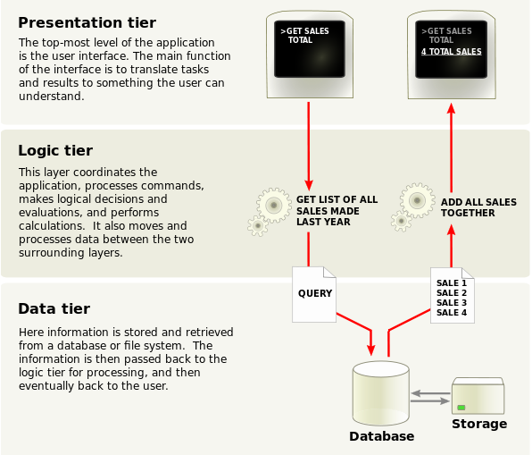
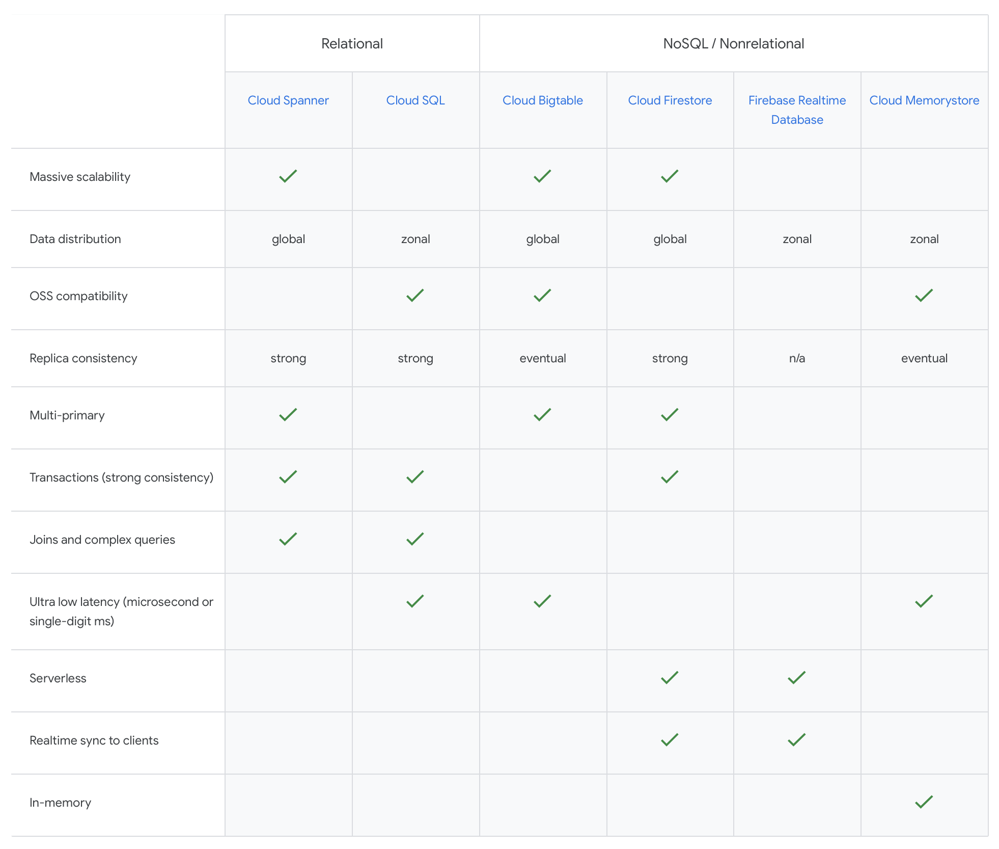
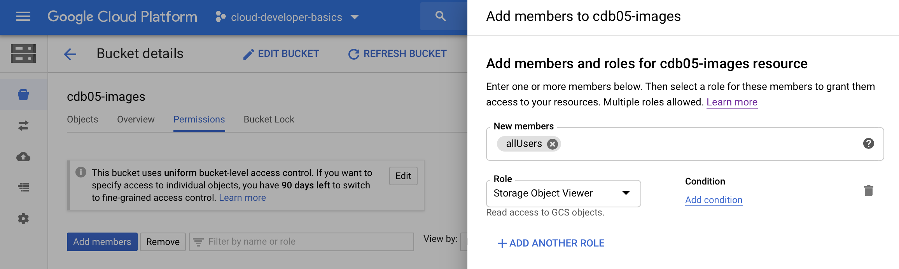
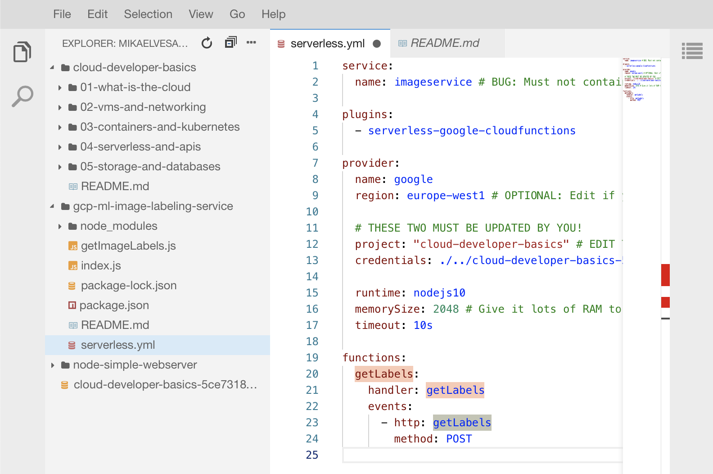
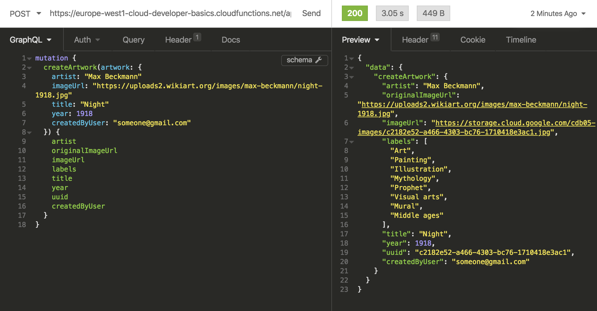
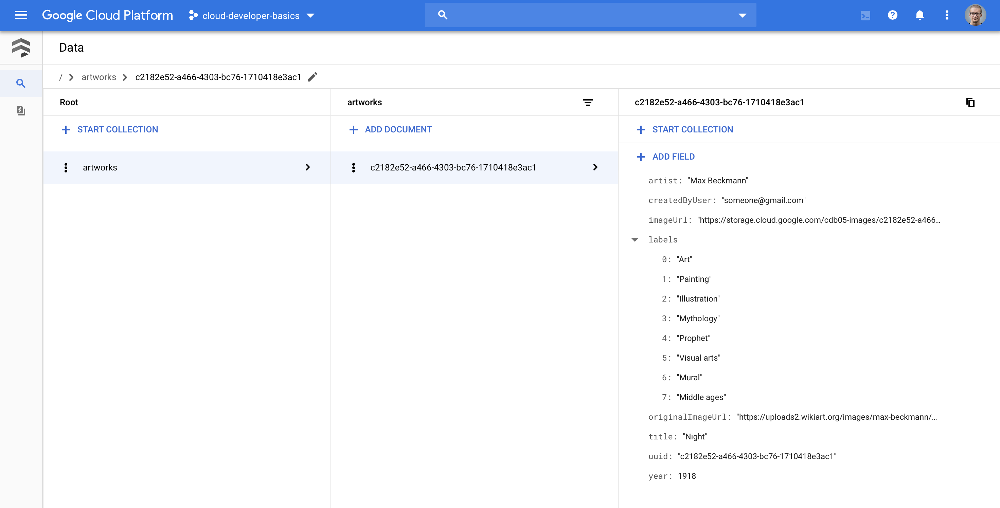
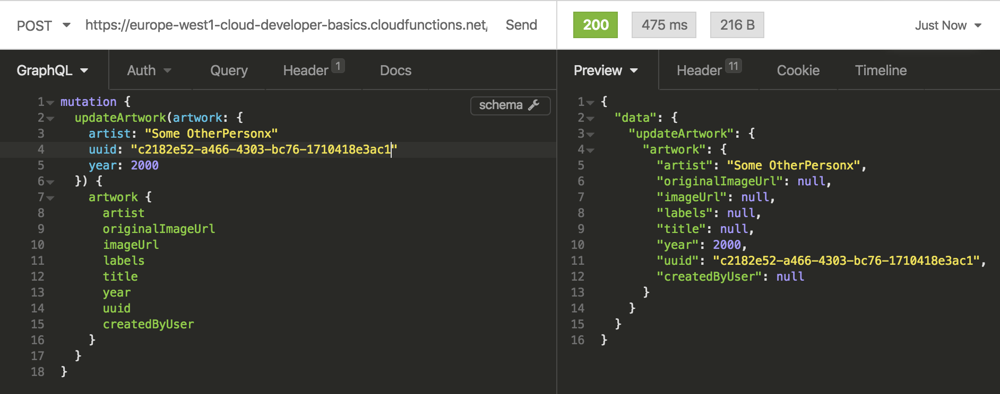
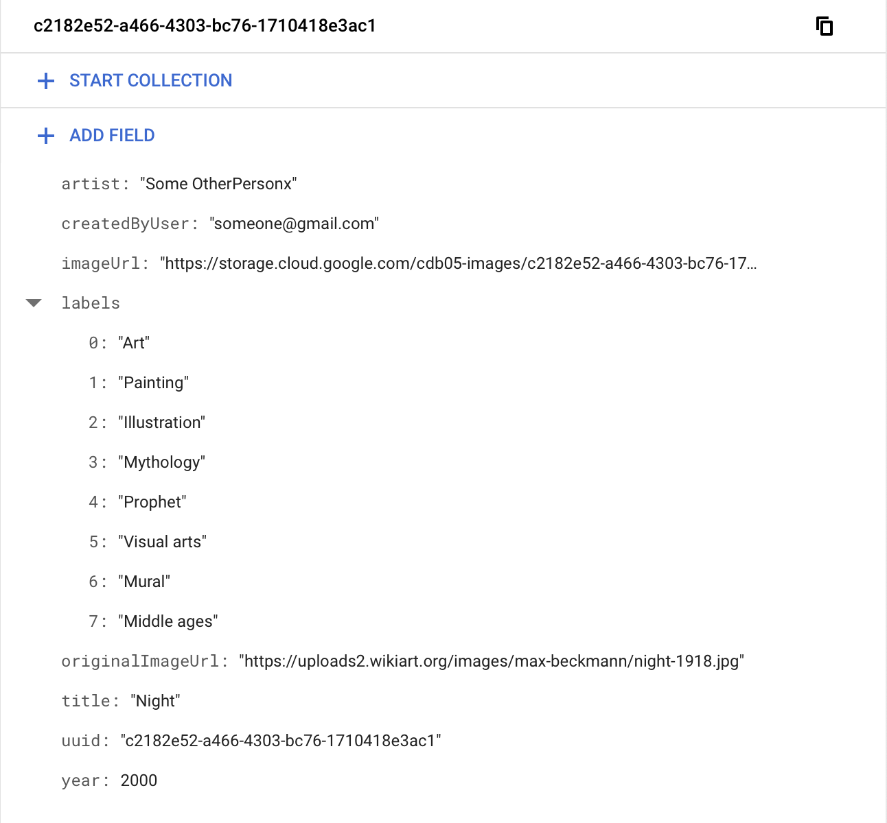

# Storage and databases

## Part 5 of Cloud Developer Basics using Google Cloud Platform

_It's no longer enough to only think of development as either frontend or backend work—it's all about having a wider, more rounded competency. Right now, the public cloud is the natural spot from which to grow one's skills as it envelopes many of the ways-of-working and types of products you will want to be proficient in, when levelling up your know-how. This mini-course will take you through some of the most important concepts and services, always ending with you setting up actual micro projects._

_This course is written as part of the internal skill development initiative at Humblebee, but we share it since there is a great demand for these skills. Want to work with a cloud-savvy company that naturally marries tech and design (as in UX, service, business and visual), or just plain old want to work here at Humblebee? [Get in touch](mailto:mikael.vesavuori@humblebee.se)!_

This mini-course is divided into six parts:

1. What is the cloud?
2. Virtual machines and networking
3. Containers and Kubernetes
4. Serverless and APIs
5. Storage and databases
6. DevOps

Before we begin, a few words about me. I'm [Mikael Vesavuori](https://mikaelvesavuori.se), a Google Cloud-certified Professional Cloud Architect who loves what the public cloud can help us achieve, regardless of job title. I've worked with clients such as the [Volvo](https://www.volvo.com/home.html) companies, [Hultafors Group](http://www.hultaforsgroup.com), and most recently [Polestar](https://www.polestar.com) who are setting up a completely new architecture from the ground up.

Source code to follow along is available at [https://github.com/mikaelvesavuori/cloud-developer-basics](https://github.com/mikaelvesavuori/cloud-developer-basics).

_This mini-course is not sponsored by or in any way connected to Google, other than us using their services._

---

## Learning objectives and services covered

In this workshop, you will set up a more refined GraphQL API than in the last workshop, this time utilizing a real database—[Google Firestore](https://cloud.google.com/firestore/)—rather than a local file to store and retrieve your values. You will also set up a Cloud Storage bucket to contain the images (or "artworks") that you create through the API.

Together, these will be combined to form an API that can store and return artworks (data and images) by combining the data storage in Firestore with the image storage in Cloud Storage.

Services covered:

- Cloud Storage
- Firestore
- Cloud Functions

I will also mention and briefly discuss SQL and [Google Cloud SQL](https://cloud.google.com/sql).

## Topic introduction and theory

In a traditional [three-tier application](https://www.techopedia.com/definition/24306/three-tier-application) the tiers, or layers, are the presentation layer (frontend), the business logic layer (backend) and the data storage layer (database). Even in other architectures, some relationship between these types of entities is required. Previously in this set of workshops we have looked at some of the frontend, but mostly worked with the cloud-native ways of running backends. Now it's time for data!


_Example of three-tier application. Image from [https://www.adldata.org/3-tier-architecture/](https://www.adldata.org/3-tier-architecture/)_

Data should not be conflated with the presentation-type activities, and should therefore reside on its own terms. For example, make sure to render data that is pulled from a data source, rather than hard-coding even content or system texts.

Some benefits of this type of approach is that it's safer (since you lower the risk of contaminating, losing or messing up data), it's cleaner (you know where data resides and where it should stem from) and that it should make it faster and easier to work with as you scale.

### The shapes of data and access patterns

Since data from the start has no pre-given shape (unless you are consuming already-existing data or using pre-existing models), the activity of modeling data, data structures and access patterns is very important when developing and architecting a system. You will need to be aware of several typical considerations when it comes to addressing that fact:

- How often is data written?
- How often is data pulled?
- Are access patterns going to be fluctuating or are they going to stay steady?
- Where is your data in relation to your other systems, like frontends or backends?
- How malleable is the data storage, i.e. can you add fields after setting the schema?
- How important is low latency?
- How important is it that changes are immediately synced?
- How is data secured? Who and what can read/write?
- Durability and availability requirements?
- Backup and/or replication procedures?

The above should inform your data access patterns which you can think of as _how you request and store information and in which flows_. These should stay relatively consistent as it otherwise means you are making it hard to commit to one strategy. With that said, you might need more than one database or table! Based on these patterns, and possibly many more considerations, you will be able to arrive at some kind of decision for what type of storage you need. The push and pull between requirements and context should meet how you pragmatically will have to (and can) shape the data.

As there is a proliferation of more and more database types, databases-as-a-service and so on, the choices increase all the time. Let's look at some common storage and database types.

A few years back, one of the major contenders for the Backend-as-a-Service throne was [Google Firebase](https://firebase.google.com) or more specifically its Realtime Database. It made databases feel really modern: Very easy to use, fully managed, document-style tables and no need to set up any instances or pesky connection-strings. This is arguably one of the first real serverless product that became a hit. I can't say I'm entirely sure why (though I suspect technical and performance reasons because of the similarities to a simple key-value store), but it does seem that most serverless solutions opt for the document/NoSQL style. However, the backside of this is that most companies and developers are probably most accustomed to SQL.

### SQL and "traditional" databases

SQL is a battle-tested type of database that can be used in a number of common formats like MySQL or PostgreSQL. Its main qualitities include ease-of-use, structured schemas and the possibility to easily do lookups based on known schema fields. It can also do complex joins and other aggregations of numerous tables into a single response, though those are taxing on the CPU. The problems with SQL, however, for some are much bigger than its benefits.

Using SQL makes it hard to work with unstructured data, and scaling is a problem as data grows. It's not uncommon that users of SQL databases complain about slow queries as a database's actual data is tethered to a pained, old machine. Even in the cloud context of managed SQL, like Cloud SQL, scaling and provisioning can be realistic, and bad, problems to deal with.

In the "big data" context, data warehouses have been a pattern that attempts to collect data and make it available for processing. For OLAP (Online Analytical Processing) purposes, SQL can be good, since it's easy to query the data. SQL is also what powers query engines/data warehousing solutions like BigQuery.

These facts result in SQL often powering small application databases (easy, fast enough, familiar to developers) and being a preferred query language for analytical queries (easy queries, broad industry usage, de factor standard in data analytics) where performance is not as important.

An actual example of querying an SQL query to get the most liked fruit from a table called "fruitTable" with a column named `favoriteFruits`, could be:

```
SELECT "favoriteFruits" FROM "fruitTable"
GROUP BY "favoriteFruits"
ORDER BY COUNT(*) DESC
LIMIT 1;
```

There are more references and examples in the _References_ section at the bottom of this article.

### Document databases, key value stores and NoSQL

When it comes to unstructured data, NoSQL is the standard to reckon with. A common way to use NoSQL is by implementing either a document database or a key value store. One document database is Google Firestore, where the table includes documents that are similarly nested as JSON files. An example of a key value store is [Cloudflare Workers KV](https://www.cloudflare.com/products/workers-kv/). In practice, these two sorts of NoSQL databases are similar. The benefit of NoSQL is typically that they are extremely fast, almost infinitely scalable, and could contain any type of data structure. The backside is that you have to understand very well what you are doing and how the database expects you to work with it, in order to claim all the performance benefits.

From our upcoming code, this (slightly modified) example shows how to use Firestore in Node/JavaScript:

```
firestore
  .collection("fruitsTable")
  // .where('favoriteFruits', '==', favoriteFruits) // SQL-like syntax! It's possible to use "where" statements when querying
  .get()
  .then(querySnapshot => {
    // This part is specific for Firestore, and loops through all items that are captured by your query
    const artworks = [];

    querySnapshot.forEach(doc => {
      artworks.push(doc.data());
    });

    return artworks;
  })
  .then(artworks => {
    // Filter with regular Node/JS here as you wish
  })
```

Because NoSQL implementations/services _do_ have differences, make sure to prepare data structures according to best practices for your database. For example, Firestore and AWS DynamoDB on the surface may both be NoSQL databases, but are different enough in practice to warrant their own ways-of-working.

In big data, the runner-up to data warehousing is "data lakes" which, instead of structured historical data, aim at storing all types data regardless of format, type and schemas: even images, video, logs... This data would often necessitate pre-processing so it can be used by a query engine like BigQuery.


_Google: Database comparison. Image from [https://cloud.google.com/products/databases/](https://cloud.google.com/products/databases/)_

### File, block, and blob/object storage

Classic file storage is actually pretty uncommon in the cloud, at least in the scenarios where I've worked. If you require being able to access and write actual files that reside in a Network Attached Storage (NAS)-like fashion, you could use [Cloud Filestore](https://cloud.google.com/filestore/) and mount it from a virtual machine instance. Good to know it exists, but something you will likely not use a lot.

There's also _block storage_ which is similar to a hard drive or "disk"-type storage. It's something you will only really use if you have instances that require write access as they live, like a machine that processes and creates its own data. In Google, this type of storage is called [Persistent Disk](https://cloud.google.com/persistent-disk).

Blob (or object) storage in Google Cloud is called _Cloud Storage_ (in AWS you may know it as _S3_ and in Azure simply as _Azure Storage_). While a "file" uploaded into Cloud Storage looks like a file in a regular file system, this is actually not the case. In fact, they exist in a kind of key-value store where the path is the key. This type of storage is perfect for web-scale, (near-)infinite storage with consumers being systems and users. It's also very cheap and forms one of the core products in any of the cloud providers' portfolios. In event-driven architectures, the possibility to trigger events on file/object changes makes Cloud Storage a great fit for modern applications and complex and/or chained behaviors. Cloud Storage should be your go-to solution in most cases.

It's common among the cloud providers to have some kind of "Storage classes" that segment factors like immediate global availability (for a higher cost) from low-availability, on-request blob storage that's meant for archival use (for a very low cost). AWS, Azure and Google have a bit of different takes on this, but they mostly are on a sliding scale where the main factors are how performant and accessible they are. As you start, you should rely on the default standard storage class, and begin using additional classes only as you understand them and your usage better.

### Some reasonable guidance on data practices in the cloud

I'll cap off the overview part with some recommendations for your cloud data practices:

- Avoid overfetching data; this is why you want GraphQL for example as it makes this easier
- Data is expensive in time and money so cache at every layer possible: client, edge, API, use an interim cache like Redis or Memcached, cache in the database itself if possible
- From a security perspective, avoid over-privileging rights (goes for all cloud development); for example, a function that can read from a database should not also be able to write to it
- **Really** learn your NoSQL database of choice, and understand that its access patterns are NOT the same as for relational databases
- Be very careful about how functions that allow write and/or delete access are managed; ideally you should have a system-to-system allowance (like IAM) that grants verified systems access to each other, and for physical users those should always be authenticated first

## Core concepts

- Storage classes
- Access patterns
- Relational data
- Non-relational data
- Consistency
- Data normalization
- Data warehouse
- Data lake

### Storage classes

A concept that describes the qualities and properties of how storage is going to be handled. Will commonly affect pricing, durability, availability and performance. You want to choose a class that is fit for your purpose, such as standard storage for files that are used a lot, and archival storage for long-term backups.

### Access patterns

A description of the ways in which you access data, such as the flows, systems/users involved, and which parts of the data that are read/written.

### Relational data

Data that is ordered in columns and rows and which is bound to a common schema. Relational data is often very easy to query within and find relations between items.

### Non-relational data

Data which does not necessarily have a common schema and which cannot typically easily be related to other items. Has the benefit of being very fast to search in.

### Consistency

The property of data to describe its usability. In the cloud, consistency often refers to data being in the same state across multiple sources (such as a multi-active database with automatic replication). Can be "eventually consistent" where changes are guaranteed to be the same soon, or "strongly consistent" where all requests will be the same, but potentially after also accepting any intermittent delays in-between calls.

### Data normalization

[A process in which data or databases are made more effective by reducing redundancy](https://en.wikipedia.org/wiki/Database_normalization). This is important when dealing with relational data, but makes less sense with non-relational data.

### Data warehouse

A model of data storage where data of similar type is stored together, usually in very large quantities. Used in big data and other domains where large-scale data processing happens. Makes it easy and manageable to extract and transform data for new usage.

### Data lake

Data storage where many different unordered types of data are stored. Also used in big data/processing domains. Has the benefit of complete flexibility in processing and is preferred in many cases today to the more rigid data warehousing model. This model's flexibility could also feed further funnels, like more specialized data warehouses.

## Workshop

In the workshop we'll set up an updated version of the API in workshop 4, together with a database trigger function, and a new storage bucket. We will also work completely within the Google Cloud environment as well as in the editor mode.

_If you haven't already, go to the [APIs & Services](https://console.cloud.google.com/apis/library) view and enable the APIs for *Deployment Manager v2 API*, *Cloud Vision API* and *Google Cloud Firestore API*._

### Step 1: Create Google Cloud Storage bucket

We will use the Google Cloud GUI to create a public bucket to contain the images/artworks that are "created" through the API.

Search for, or go to, the [Cloud Storage](https://console.cloud.google.com/storage/browser) view. Click _Create bucket_. We will use whatever bucket name you specify here, so make something simple up that's rememberable and clear like `cdb05-images`. Note that the bucket name needs to be globally unique, in case it disallows your bucket name. Use the single-region location type and set it to `europe-west1` (so we co-locate with the Cloud Functions for best latency). Set a "uniform" bucket policy so we can proceed to setting the entire bucket to be public in a bit. Hit the _Create_ button.


_Cloud Storage view: Bucket created_

Switch to the _Permissions_ tab. Click _Add members_. Check if _allUsers_ exist and has the _Storage Object Viewer policy_, else do the following:

- Add the meta-user _allUsers_ in _New members_
- Set the role to _Storage Object Viewer_
- Click _Save_


_Cloud Storage: Setting bucket permissions to public_

You will now likely have a ribbon informing you that:

> _This bucket is public and can be accessed by anyone on the Internet. To remove public access, remove 'allUsers' and 'allAuthenticatedUsers' from the bucket's members._

Since this is precisely what we want, and because we have no specific security concerns in this mini-project about potentially accessing others' uploads, this is just fine for our use case.

### Step 2: Clone and deploy `gcp-ml-image-labeling-service`

Now, let's get some code deployed. Start the Cloud Shell ([read more here](https://cloud.google.com/shell/) if you still haven't used it). Make sure you are in the root by running `cd`.

Clone the repo from [https://github.com/mikaelvesavuori/gcp-ml-image-labeling-service](https://github.com/mikaelvesavuori/gcp-ml-image-labeling-service) with `git clone https://github.com/mikaelvesavuori/gcp-ml-image-labeling-service`. That's going to be your image labeling service.

Step into the folder with `cd gcp-ml-image-labeling-service`. Install dependencies with `npm install`. In Cloud Shell, you won't have Serverless Framework so install it globally with `npm install -g serverless`. Launch the editor mode (top right of the Cloud Shell bar) to use the nice editing mode—of course, if you like `vi` or `nano` those are fine too, but I will continue as if you were using the editor. If your browser won't let you run it because of cookie blocking, let Google open it in a new tab and it should work. I recommend you to have both Cloud Shell and the editor open. It's fine if they are in separate tabs.


_Google editor view: Updating `serverless.yml`_

Open `serverless.yml`, setting the project and credentials to your own values. If you're still doing this in Cloud Shell, make sure to drop in your credentials file so you can deploy code with Serverless. If you need a refresher, follow along with ["Step 3: Create a service account" in Serverless & APIs](https://medium.com/@MikaelVesavuori/serverless-technologies-and-apis-1096a99b77f0). If the keyfile is in the root your credentials path would look similar to `./../my-keyfile-1234.json`.

Deploy with `sls deploy`. Note/copy the endpoint URL you get.

#### Troubleshooting deployment errors

If you face odd deployment problems, and you've used Serverless Framework before, go to [Deployment Manager](https://console.cloud.google.com/dm/deployments) and delete any old stacks, as those can cause issues if you re-deploy something with the same name.

If you haven't deployed with Serverless before, try running `sls remove` and then `sls deploy` again. Worst case, if it does not work, change the service name in `serverless.yml` and it should start working.

### Step 3: Validate that the image labeling service works

Use a REST client like [Insomnia](https://insomnia.rest) to run a POST against your endpoint. A payload could look like:

```
{
  "imageUrl": "https://resize.hswstatic.com/w_907/gif/bengal-cat-1.jpg"
}
```

Your respective labels would be:

```
[
  "Cat",
  "Mammal",
  "Vertebrate",
  "Small to medium-sized cats",
  "Felidae",
  "Bengal",
  "Carnivore",
  "Whiskers",
  "Toyger",
  "Ocicat"
]
```

If you don't get any labels it seems possible that some sites somehow are blocking the image fetching request that the service makes. No cause for alarm, but good to know that not all images will be accepted for whatever reason.

Good to go? Time to set up the API.

### Step 4: Clone `cloud-developer-basics` and configure the API

Go to the root of your Cloud Shell disk, with `cd`.

Clone the repo from [https://github.com/mikaelvesavuori/cloud-developer-basics](https://github.com/mikaelvesavuori/cloud-developer-basics) with `git clone https://github.com/mikaelvesavuori/cloud-developer-basics`. This is where you will find the API code.

Step into the folder in Cloud Shell with `cd cloud-developer-basics/05-storage-and-databases/backend`. Install dependencies with `npm install`.

In the editor, make the same changes that you did to the previous `serverless.yml`. Just mind the path so it can resolve the keyfile in this more deeply nested folder (hint: for a relative path it's `./../../../keyfile.json`). Then, open `configuration.js` in the backend repository and enter your own values; also enter the name of the bucket you created earlier. Step into the root of this repository (`backend` folder) and run `sls deploy`.

While it's deploying, also take a few minutes actually browsing and reading the API code, especially in the `functions` folder. You will see that the functions are similar to the code in workshop 4 but that there is now actual implementation details around using a real database, as well as some filtering.

### Step 5: Firestore setup

Go to [Firestore](https://console.cloud.google.com/firestore/). There shouldn't be too much config here. If you get a complaint about API not being enabled, go to the [APIs & Services](https://console.cloud.google.com/apis/library) view and enable it there.

With that, Firestore should be ready to go. It's about time we actually start toying with the database!

### Step 6: Create a new document (i.e. artwork)

Creating an artwork (resulting in a document in Firestore and an image passed to Cloud Storage) is kind of the queen bee of all functions.

An example of using it could be:

```
mutation {
  createArtwork(artwork: {
    artist: "Barnett Newman"
    imageUrl: "https://uploads3.wikiart.org/00202/images/barnett-newman/stations-of-the-cross-1958-1966.jpg"
    title: "Stations of the Cross"
    year: 1958
    createdByUser: "someone@gmail.com"
  }) {
    artist
    originalImageUrl
    imageUrl
    labels
    title
    year
    uuid
    createdByUser
  }
}
```


_Insomnia: Creating a new document_

Your response will turn back a number of fields as per above GraphQL query, but the one you want to look for is `uuid` which is unique per request. An example of a UUID is `0baaec39-4c64-416c-9e3d-def1b615fd3e`. The image name and the document name will correspond to this UUID. Since this will likely only be your first, there's pretty much no actual problem of finding what you did. But now you know.


_Firestore: Validating that the document was created_

Check Firestore so the entry got in. Then, validate in your bucket that the image appears in it. If you click the image and copy the URL (not the `gs://` version, but the `Link URL` one) it _should_ be publicly viewable.

### Step 7: Update the document

Go ahead and update the created artwork. Pass the `uuid` value to update the correct document.

```
mutation {
  updateArtwork(artwork: {
    artist: "Some OtherPerson"
    uuid: "0baaec39-4c64-416c-9e3d-def1b615fd3e"
  }) {
    artwork {
      artist
      originalImageUrl
      imageUrl
      labels
      title
      year
      uuid
      createdByUser
    }
  }
}
```


_Insomnia: Updating a document_

My painting by Barnett Newman is now attributed to Some OtherPerson, hope no one disapproves of this move.


_Firestore: Validating that the document was updated_

### Step 8: Get all documents

To get all documents, run:

```
query {
  getArtworks {
    artist
    imageUrl
    title
    year
    labels
    uuid
    artist
  }
}
```

Good to use in a bit, when you've created a bit more substantial volume.

### Step 9: Get a named document

You can also easily get a document by title, with a function dedicated only for this purpose:

```
query {
  getArtworkByTitle(title: "Night") {
    artist
    imageUrl
    title
    year
    labels
    uuid
  }
}
```

In this case, the `getArtworkByTitle` function is provided as one of several patterns for getting items. In this case, getting by title may be some important and central to your application/system that it makes sense to operate it as its own thing, including specific optimizations. In this specific case, we can leverage Firestore's built-in support for SQL-like queries: `.where('title', '==', title)` to get better performance and nicer code.

### Step 10: Add new artworks to fill out the database

Repeat the `createArtwork` process with new images. Some examples of awesome resources include [Artsy](https://www.artsy.net/collect), [WikiArt](https://www.wikiart.org), [Moderna Museet collection](https://sis.modernamuseet.se), or [Museum of Modern Art collection](https://www.moma.org/collection/)!

Remember that you need:

- Name of the artist
- Image URL
- Title of the work
- Year when it was made
- You also need `createdByUser` set to some value

Make sure to add some artworks that overlap with any of the properties, such as `artist`.

### Step 11: Filter your artworks

Let's try the filtering. In the below example, we want everything we've added by Barnett Newman.

```
{
  getArtworkByFilter(artist: "Barnett Newman") {
    [REMOVED FOR BREVITY]
  }
}
```

For me, this returns two artworks. What if I just want the one?

```
{
  getArtworkByFilter(artist: "Barnett Newman", title: "Stations of the Cross") {
    [REMOVED FOR BREVITY]
  }
}
```

Much better!

### Step 12: Create a Firestore event trigger

Time for our final Serverless deployment. Navigate to `cloud-developer-basics/05-storage-and-databases/trigger`. Again, make sure to set up your own values in `serverless.yml`; just copy what you had in the API/backend YML file. This time you also need to provide an environment variable so the function will know where your bucket is located. Sometimes, especially in cloud functions, it's more convenient to set configuration values in this YML than in the actual code, especially if it's shared. Get used to this pattern! Under `environment.BUCKET_NAME`, set this to the name of your Cloud Storage bucket.

Run `npm install` followed by `sls deploy`.

### Step 13: Delete a document and validate the trigger removes the document's image

While you've been able to delete a document since the first moment you successfully deployed the API, it would have left the image in the bucket if you where to delete a document. After creating the event trigger just now, you can connect those two, so deletion of a document will remove its image.

Let's try it:

```
mutation {
  deleteArtwork(uuid: "ccad61d9-d9bc-4be3-a3c4-061bd970f59e") {
    uuid
  }
}
```

Validate in your bucket as well as in Firestore that the document/image with that UUID is removed. Sweet! You're done and you are ready to use modern database patterns in your cloud-native apps. **KA-CHING**

## Further studies

Listed here are recommended additional resources and tasks to improve your understanding and build up your foundational experience.

### Explore more

- Add a simple frontend and require user authentication before using the API. Visit the [Firebase console](https://console.firebase.google.com/) and start a new project. You'll need to whitelist your development domain (127.0.0.1, localhost, or whatever you have) and choose an authentication method, easiest of which would probably be email or Google if this is your first time. [Implement the client SDK using the example code provided in the official docs](https://firebase.google.com/docs/web/setup).
- **On that note**: Try using [Firebase Hosting](https://firebase.google.com/docs/hosting/functions) which provides a convenient way to host your website on the same domain as your backend functions

More in-depth exercises would be:

- Require that the API is authorized to run the API (i.e. Cloud Function); example at [https://github.com/mikaelvesavuori/gcp-cloud-endpoints-authed-function](https://github.com/mikaelvesavuori/gcp-cloud-endpoints-authed-function)
- Add trigger function that resizes and puts images in Cloud Storage
- Instead of Firestore, use Cloud SQL, since SQL is still a vital piece for many companies and situations. If you are attempting any certificate, expect there to be questions around Cloud SQL!

### References

#### Cloud Shell

- [Getting the Best out of Google Cloud Shell](https://medium.com/google-cloud/getting-the-best-out-of-google-cloud-shell-3d6ca64bc741)

#### Choosing databases

- [Choose a Database: Cloud Firestore or Realtime Database](https://firebase.google.com/docs/database/rtdb-vs-firestore)
- [Google Cloud Databases](https://cloud.google.com/products/databases/)
- [From Blobs to Tables: Where and How to Store Your Stuff (Cloud Next '19)](https://www.youtube.com/watch?v=9iB6o1BXsK4)
- [Azure: Choose the right data store](https://docs.microsoft.com/en-us/azure/architecture/guide/technology-choices/data-store-overview)
- [Wikipedia: Document-oriented database](https://en.wikipedia.org/wiki/Document-oriented_database)

#### Firestore

- [Get started with Cloud Firestore](https://firebase.google.com/docs/firestore/quickstart)
- [Perform simple and compound queries in Cloud Firestore](https://firebase.google.com/docs/firestore/query-data/queries)
- [Aggregation queries](https://firebase.google.com/docs/firestore/solutions/aggregation)
- [Advanced Data Modeling With Firestore by Example](https://angularfirebase.com/lessons/advanced-firestore-nosql-data-structure-examples/)
- [The trade-offs between performance, cost, and security with Firestore](https://medium.com/firebase-developers/the-tradeoffs-between-performance-cost-and-security-with-firestore-ef72ba43f316)
- [Model Relational Data in Firestore NoSQL](https://www.youtube.com/watch?v=jm66TSlVtcc)
- Bonus: [Exporting and Importing data to/from Firestore using Google Sheets](https://liftcodeplay.com/2020/02/08/exporting-and-importing-data-to-from-firestore-using-google-sheets/)

#### SQL

- [List of SQL Commands: Glossary of commonly used SQL commands](https://www.codecademy.com/articles/sql-commands)
- [11 Common SQL Statements with Basic Examples](https://database.guide/11-common-sql-statements-with-basic-examples/)
- [The Best SQL Examples](https://www.freecodecamp.org/news/sql-example/)

#### Database triggers

- [Using Firebase triggers in Serverless Framework](https://medium.com/ponce-agtech/using-firebase-triggers-in-serverless-framework-ad99594b86fa)
- [Cloud Firestore triggers](https://firebase.google.com/docs/functions/firestore-events)

#### Authentication

- [Get Started with Firebase Authentication on Websites](https://firebase.google.com/docs/auth/web/start)
- [Securing Google Cloud Functions Using Service Account and How to Access it in Service-Service Communications](https://medium.com/google-cloud/securing-google-cloud-functions-using-service-account-and-how-to-access-it-in-service-service-582b4b5f210)

### Qwiklabs

Qwiklabs are short and highly concrete lab-style tutorials. You need a free account to view them. To fully use these you need a paid membership — it should be possible to follow along and work your way through them on the free account though since the paid membership usually only adds the sandbox environment.

- [Firebase Web](https://www.qwiklabs.com/focuses/660?parent=catalog)
- [Build a Serverless Web App with Firebase](https://www.qwiklabs.com/focuses/8391?locale=se&parent=catalog)
- [Importing Data to a Firestore Database](https://www.qwiklabs.com/focuses/8392?parent=catalog)
- [Cloud SQL](https://www.qwiklabs.com/quests/52)
