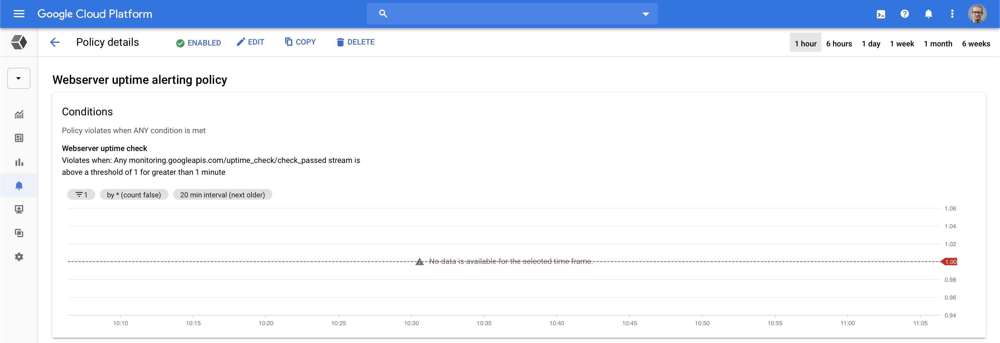

# DevOps: Commit, build and deploy your code

## Part 6 of Cloud Developer Basics using Google Cloud Platform

_It's no longer enough to only think of development as either frontend or backend work—it's all about having a wider, more rounded competency. Right now, the public cloud is the natural spot from which to grow one's skills as it envelopes many of the ways-of-working and types of products you will want to be proficient in, when levelling up your know-how. This mini-course will take you through some of the most important concepts and services, always ending with you setting up actual micro projects._

_This course is written as part of the internal skill development initiative at Humblebee, but we share it since there is a great demand for these skills. Want to work with a cloud-savvy company that naturally marries tech and design (as in UX, service, business and visual), or just plain old want to work here at Humblebee? [Get in touch](mailto:mikael.vesavuori@humblebee.se)!_

This mini-course is divided into six parts:

1. What is the cloud?
2. Virtual machines and networking
3. Containers and Kubernetes
4. Serverless and APIs
5. Storage and databases
6. DevOps

Before we begin, a few words about me. I'm [Mikael Vesavuori](https://mikaelvesavuori.se), a Google Cloud-certified Professional Cloud Architect who loves what the public cloud can help us achieve, regardless of job title. I've worked with clients such as the [Volvo](https://www.volvo.com/home.html) companies, [Hultafors Group](http://www.hultaforsgroup.com), and most recently [Polestar](https://www.polestar.com) who are setting up a completely new architecture from the ground up.

Source code to follow along is available at [https://github.com/mikaelvesavuori/cloud-developer-basics](https://github.com/mikaelvesavuori/cloud-developer-basics).

_This mini-course is not sponsored by or in any way connected to Google, other than us using their services._

---

## Learning objectives and services covered

This is the sixth and last installment in the Cloud Developer Basics course. Despite the name, this time it will _not_ be very basic. What's a final chapter without a level boss, eh? Now's the time when you'll get a full-on sense of automating and scripting a more-or-less realistic application under production-like circumstances.

Services covered:

- Cloud Source Repositories
- Container Registry
- Cloud Build
- Compute Engine
- VPC
- Cloud CDN and HTTPS Load Balancer

## Topic introduction and theory

Operations is what happens when code meets reality. This is the state when code is deployed successfully, live and available, and user-facing.

Operations gets a bad rap for various reasons but is mission critical for anyone making software. Even a lowly freelance front-end developer is doing ops when they help their local Buffy The Vampire Slayer club stay up and running under the load of 50+ geeks editing fan fiction on your Wiki platform. The thing with ops is that _what it was_ is different from _what it's becoming_. Lots of the churn and manual work often attributed to ops can now (and should!) be automated or reduced. Big cloud providers like Google make this—if not easy as pie—then at least more than manageable.

The DevOps movement is a broad term that tries to package both the hard (software, standards) and soft (people, culture, organization) factors involving in being a performant, well-functioning software delivery company. To get to a state of complete software delivery nirvana, one of the core ideas is to enable developers to contribute meaningfully through the full lifecycle, including areas like:

- **Provisioning**: infrastructure resources and services
- **Deployment**: commit, build, deploy, serve
- **Quality**: test automation, security and compliance
- **Operations**: monitoring, logging

DevOps therefore requires creating a wider individual developer commitment and removing specializations (at least to some degree) especially those that impact the _time_ axis, that is, those who work on a product in its early stages ("builders") and those who work on it post-release ("maintainers") and ultimately face the customer. [This is the context in which the adage "you build it, you run it" was minted at Amazon](https://www.atlassian.com/incident-management/devops/you-built-it-you-run-it). Following Gene Kim's "three ways of DevOps", teams should aim at [automating processes, contextualizing developer choices in reality (ops), and continuously improving their processes](https://www.atlassian.com/agile/devops).

This is my highly subjective picture of some key benefits that implementing DevOps brings:

- **Increased innovation speed**: For example by using microservices, decoupled architectures, or Platforms-as-a-service or similar; makes improvement cycle times drastically shorter
- **Increased product delivery speed**: For example by doing Continuous Deployment instead of big releases; makes it easier to provide high customer satisfaction "on time"
- **Increased capabilities to own and deploy all layers of a system**: Teams should have wider, or even full, possibility to deploy anything from databases to APIs to front-end applications to own and maintain their solution
- **Increased insight to support decreased failure rate**: Let teams have full control of monitoring and other accesses to system health so they can effectively fix errors and other problems in their daily work
- **Quality is regulated through guardrails rather than through gate-keeping**: For example, provide baseline implementations that show patterns and conform to quality and security benchmarks; these must be visible and possible for teams to adjust and improve

[There are lots of benefits with DevOps…but it's hard to implement less because of software and more because you can't forget the human and organizational aspects!](https://www.youtube.com/watch?v=8M3WibXvC84)

Organizations are seeing that this is something they can benefit greatly from, one reason being that typical maintenance is a pure loss activity and does usually not add any new value. Also, developers are actively seeking this way of working since it leads to shorter feedback loops, more involved work, and [higher work satisfaction](https://cloud.google.com/solutions/devops/devops-culture-job-satisfaction).

While there is also an expanded concept, called [no-ops](https://www.zdnet.com/article/theres-no-ops-like-noops-the-next-evolution-of-devops/), it's likely not a state we'll reach collectively in quite some time. There is for now always some manual intervention required.

### Think smaller, deploy more often

While CI/CD ([continuous integration](https://www.atlassian.com/continuous-delivery/continuous-integration) matched with [continuous deployment](https://www.atlassian.com/continuous-delivery/continuous-deployment) is not the sole crowning jewel of DevOps, it's one of several big cultural touchpoints of it. More staid organizations tend to want to look at large "big bang" releases with long feature lists, lengthy docs of manual verifications and gate-keeping processes and war rooms that collect every single person who had anything at all to do with the product before going into the warzone that is "production". In this world, merges can be tedious and error-prone processes where work done over long periods of time have to be integrated and deployed by the boatload.

Instead, Continuous Integration is all about code changes being committed and merged to the mainline or trunk of your code base frequently, often many times per day. While younger developers today may have known Git (maybe even Subversion) from their early days, in the longer scope the normalization of CI practices has just recently happened. In short: CI happens when you have some kind of version control tool that can merge code and then build it in some platform (like Cloud Build, Github Actions, Bitbucket Pipelines, Travis CI, Jenkins…). Using a pattern like [Trunk-Based Development](https://trunkbaseddevelopment.com), one can further harden the process whereby work is done only in small short-living branches and must be merged to the trunk ("mainline" or "master" branch). Features or changes that are too big to contain without a couple of days of work should be programmatically disabled behind so called feature flags or with canary releases.


_Trunk-based development has received lots of traction in the last several years, and works well both at scale and in small teams._

Moving on, Continuous Deployment has become less of an impossible holy grail, and more of the gold standard which many (still not everyone, because it sounds dangerous for some orgs) tries to reach. To really and truly do continuous deployment is also a matter of verifying that your rapid throughput is also held to some kind of dignified quality standards; usually these are automatic tests, which could be of the unit, integration, system variety or some such. A hardline approach to the omnipresent requirement of tests has been the movement called [Test-Driven Development](https://martinfowler.com/bliki/TestDrivenDevelopment.html) which states that the test itself is the product and origin of your code. CI/CD is not contingent on accepting the tenets of TDD, but a strategy is needed lest you will just have a straight pipeline that pushes garbage out very fast.

_None of the above can or should be done with large sets of code changes a few times per months_—this is completely based on doing small sets of changes that impact production code multiple times daily.

### Build anything with infrastructure Lego

Providers like Google Cloud, AWS and Azure have also made significant commitments to creating products and services that dramatically decrease regular operations, abstract away the hardest domain-specific skill requirements and also make these services affordable to use in real production environments. We've already looked at a lot of such services, like Cloud Functions and Cloud Run, Firestore, Cloud Pub/Sub and Cloud Storage: all of these are extremely fast to start with, made to function under heavy loads and provide incredibly high SLA values. It's natural that DevOps teams will have to improve their skills and awareness around cloud architecture, and if they are to "own" their solutions, also understand the cost impact of choices.


_Google Cloud Platform compute service pricing comparison_

The above pricing calculation should remain accessible at [this link](https://cloud.google.com/products/calculator/#id=f24f57e8-8eb1-42ab-b6be-d0fc06473f1d).

Previous specialist concerns that could be gatekeeped, like security or ops, are now also often ingrained into the everyday practices. This has lead to the very real possibility of actually doing [DevSecOps](https://www.redhat.com/en/topics/devops/what-is-devsecops): DevOps that also embraces an ongoing security loop by also handling things like static code analysis (dependency checks, linting…).

When it comes to infrastructure, devs being able to provision services as easily as deploying code is natural in the cloud, since there is no literal hardware, and as long as you can manage configuration it's all down to doing scripting or automation of it. Therefore no (or fewer) specialists are required to run an equivalent on-premise or classic cloud stack.

Note, however, that the above does not mean that every individual has to be an expert in each area, just that the areas are becoming more approachable and that there is a move toward wider skills, rather than deep expert skills in few areas, if one is to operate a cloud environment in the best possible way. Responsibilities should, as always, be shared and divided as it makes sense in the team. That is even more true now.

### Operating the service

Maybe it's time to very briefly demonstrate how operations could look!

Google has a [full suite of operations services](https://console.cloud.google.com/monitoring) that have gone under the Stackdriver brand. At the time of writing this, as far as I understand Google is updating and removing the Stackdriver brand.


_Google Monitoring dashboard_


_Google Monitoring dashboard with some incoming data and an uptime check that shows a load balancer failing_

[Structured logging](https://cloud.google.com/logging/docs/structured-logging) is extremely important in cloud environments, especially if you are running cloud functions and/or microservices. The Logging view makes logs searchable with advanced filters and possibility to view only specific types of resources.


_Looking at all the logs for an instance group_

And of course error reporting, so you can get insights into any application issues.


_Checking last week of reported errors_

Taken as a whole, it's a lot simpler, even as an individual developer, to set up a complete cloud infrastructure, push out your code, and then be on top of any issues that may happen. As seen above, developers now have the real possibility of being informed about the second-by-second state of their applications. If they are also allowed to roll out improvements as soon as they can code them, then everyone should be having a win-win situation.

## Concepts

The following concepts will be briefly touched upon.

- Monitoring
- Continuous Integration
- Continuous Deployment
- Trunk-Based Development
- Test-Driven Development
- Feature flags
- Canary releases
- Infrastructure-as-code

### Monitoring

Using tools and logs to inspect and be updated about system or cross-system health. This has classically been a manual, reactive activity. The current best-practices include creating automatic remediations and having "aware", sometimes AI-driven, tools that can alert of non-normal activity.

### Continuous Integration

The practice and tools around merging new code into the "mainline" or master code base, and doing so on a frequent basis, usually several times per day.

### Continuous Deployment

The practice and tooling that concerns putting code in its desired state and onto the correct hardware (servers etc.), often as a direct consequence of having being just built by a CI tool.

### Trunk-Based Development

A method that espouses frequent commits to the mainline code branch and wishes to only minimally use feature (and non-master) branches. This could have the effect of aggressively promoting code for deployment, when combined with continuous deployment.

### Test-Driven Development

A methodology that puts the test as the primary and most valuable piece of code. This method highly values the stability of the code. The anti-thesis to this could be tests written after "code complete", that is, tests that _prove_ functionality that already is known and existing.

### Feature flags

Feature flags are a simple concept that is often likened to boolean true/false switches that can turn on or off new/unstable functionality. The concept deals with having a "soft", non-code possibility (could even be fully dynamic in the code) to activate or deactivate parts of the code base. This is deemed by many an important co-feature to address when doing trunk-based development as that risks putting unstable code into production environments.

### Canary releases

A release that is gradually rolled out, often from 0% to 100%. The canary is monitored and observed so any errors and problems that happen with it are caught when it is only affecting a limited amount of users. Upon a serious problems, the canary can be rolled back and all traffic can be diverted back to the previous stable version.

### Infrastructure-as-code

Instead of running scripts to operate and provision services and infrastructure, several tools exist to do so through standardized configuration templates. There are native variants for the three big clouds, but the most common cloud-agnostic tool is Terraform. Having these configs in a pipeline creates a foundation of highly stable, version-controlled, visible infrastructure that can easily be adjusted and improved.

## Workshop

This workshop will give a more or less realistic full-scope view on how to run a globally available application in the cloud, with a DevOps mindset, from initial commit to taking down infrastructure. This means:

- Setting up a source code repository and a build pipeline that should fail when tests aren't passing
- Using a custom template to start a managed instance group which will serve our app
- Setting up custom networking
- Creating an HTTP load balancer with CDN capability to soak up traffic

While the above may sound daunting, many of these things we've already done before.

This workshop will be strictly within Google Cloud and the Cloud Shell, and will primarily involve scripting rather than GUI-based actions. Scripting or automation in general is the "real" way this type of activity would happen, so this will give you a better contextual understanding as well.

### Step 1: Export variables

Log into Google Cloud and open Cloud Shell.

This workshop will require a very long list of variables, so export them by copy-pasting them into Cloud Shell. It should be sufficient to use the variables as-is, but if you feel adventurous you could modify as needed/wanted.

```
# YOU PROBABLY WANT TO EDIT THESE, BUT IS NOT REQUIRED
export IMAGE_NAME="webserver"
export REGION="europe-north1"
export ZONE="europe-north1-b"
export REPO_NAME="webserver"
export GIT_NAME="Demo User"

# ONLY EDIT IF YOU HAVE OPINIONS
export PROJECT_ID=$(gcloud config get-value project)
export GIT_EMAIL=$(gcloud auth list --filter=status:ACTIVE --format='value(account)')
export CONTAINER_TAG="latest"
export CONTAINER_PATH="gcr.io/$PROJECT_ID/$IMAGE_NAME:$CONTAINER_TAG" # Must match image output in cloudbuild.yaml
export NETWORK_NAME="mynetwork"
export SUBNET_NAME="mynetwork-subnet"
export FIREWALL_RULE_NAME="allow-inbound-tcp-80"
export INSTANCE_GROUP_NAME="webserver-instance-group"
export INSTANCE_TEMPLATE_NAME="webserver-container-instance-template"
export INSTANCE_COUNT_MIN=3
export INSTANCE_COUNT_MAX=5
export HEALTH_CHECK_NAME="instance-health-check"
export BACKEND_SERVICE_NAME="mybackendservice"
export FRONTEND_SERVICE_NAME="myfrontendservice"
export LOAD_BALANCER_IP_RESOURCE="loadbalancer-ip"
export URL_MAP_NAME="loadbalancer"
export PROXY_NAME="lb-target-proxy"

gcloud config set compute/region $REGION
gcloud config set compute/zone $ZONE
```

These are also available in the repo under `scripts/setup.sh`.

### Step 2: Create a repository and build trigger

Let's create a repository in Google Cloud. Run

`gcloud source repos create $REPO_NAME`

We now instantly have a repository called **webserver** (unless you changed the variable). Make sure you can see it in [Source Repositories](https://source.cloud.google.com/). I recommend you keep this open in its own tab as we continue.

We will also need a Cloud Build trigger to activate builds when committing code to our master branch, as per Trunk-Based Development.

```
gcloud beta builds triggers create cloud-source-repositories \
  --repo $REPO_NAME \
  --branch-pattern "master" \
  --build-config "cloudbuild.yaml"
```

### Step 3: Clone and configure `node-simple-webserver` and push it to your own repository

We need source code so go ahead and clone some code with

`git clone https://github.com/mikaelvesavuori/node-simple-webserver.git`

Open `cloudbuild.yaml` in the source code with `vi`, `nano` or the built-in Editor (located to the right in the Cloud Shell navbar). If you use the Editor its probably easiest to also keep that one open in its own tab. Now, update the configuration to point to your own project ID and repository/image. I suggest `webserver` for the second one. Step back into your root when you are done if you use `vi` or `nano`.


_Editor: Update cloudbuild.yaml_

We'll now clean up the source code a bit and change our port to 80 (not really a very secure and smart idea, but works fine for the purposes of this workshop). Let's also remove previous Git data to avoid pesky conflicts.

```
cd node-simple-webserver
rm -rf .git
rm -rf serverless
rm build-aws.sh
rm build-gcp.sh
rm buildspec.yml
sed -i -e 's/8080/80/g' Dockerfile
cd src
sed -i -e 's/8080/80/g' index.js
cd functions
sed -i -e 's/return a + b/return a + b + 1/g' calc.js
cd ..
cd ..

git init
git config user.email "${GIT_EMAIL}"
git config user.name "${GIT_EMAIL}"
git remote add origin \
  https://source.developers.google.com/p/$PROJECT_ID/r/$REPO_NAME
git add .
git commit -m "Initial commit"
git push --set-upstream origin master
```

The above updates the files as explained and pushes it to your new repository.

Go to [Cloud Source Repositories](https://source.cloud.google.com/) and verify that the code exists there too. I recommend you keep this open in its own tab as we continue.


_Source Repositories: Initial commit to repo_

### Step 4: Inspect the build; fix the failing test

When the code gets pushed through Git, Google will use [Cloud Build](https://console.cloud.google.com/cloud-build/dashboard) (open it in a new tab) to work on your code based on what you tell it to do in `cloudbuild.yaml`. Our usage this far asks Cloud Build to:

- Install dependencies (`npm install`)
- Test the application (`npm test`)
- Build the Docker image
- Push the Docker image to Container Registry

Go to Cloud Build and you should notice that the build fails with `ERROR: build step 1 "gcr.io/cloud-builders/npm" failed: exit status 1`.


_Cloud Build: Build failed on Test stage_

Using whatever tool you feel comfortable with in Cloud Shell, open `node-simple-webserver/src/functions/calc.js`. Previously in a script we added an intended error, let's now reset it so it functions correctly. The line `return a + b + 1` should of course be `return a + b`. Fix it, then commit and push code (example: `git add . && git commit -m "Update failing test" && git push`) from the root of the app (`node-simple-webserver`).

Check Cloud Build and ensure that the build passes correctly this time. Also check in [Container Registry](https://console.cloud.google.com/gcr/images/) that you can see the image there.


_Cloud Build: Build passed_

### Step 5: Create networking infrastructure

The preparatory work is now over, your app is all set up for CI/CD, and it's now high time to begin creating the actual infrastructure to support it.

We've used the pre-packaged networks before, but this time we're going to do a custom network so we have full control. You always want the network stuff done before setting up your instances so this is just pure groundwork still.

```
# Create network
gcloud compute networks create $NETWORK_NAME \
  --subnet-mode=custom

# Create subnet
gcloud compute networks subnets create $SUBNET_NAME \
  --network $NETWORK_NAME \
  --region $REGION \
  --range 192.168.0.0/24

# Create firewall rule opening port 80 over TCP
gcloud compute firewall-rules create $FIREWALL_RULE_NAME \
  --network $NETWORK_NAME \
  --allow tcp:80 \
  --source-ranges 0.0.0.0/0 \
  --priority 100 \
  --target-tags $FIREWALL_RULE_NAME
```

You can now find the networks in the [VPC networks](https://console.cloud.google.com/networking/networks/list) view. The firewall rule is at [Firewall rules](https://console.cloud.google.com/networking/firewalls/list).

### Step 6: Create compute infrastructure

We could set up individual computers, but let's create a template instead so we can make as many copies we want of our particular setup. The template can also be used to power a Managed Instance Group. This is what we want. It's also good having a "health check" so the MIG can know whether instances are experiencing downtime; let's add one of those too.

```
# Create instance template
gcloud compute instance-templates create-with-container $INSTANCE_TEMPLATE_NAME \
  --container-image $CONTAINER_PATH \
  --machine-type f1-micro \
  --tags $FIREWALL_RULE_NAME,http-server \
  --network $NETWORK_NAME \
  --subnet $SUBNET_NAME

# Create health check
gcloud compute health-checks create http $HEALTH_CHECK_NAME \
  --check-interval=10s \
  --unhealthy-threshold=3 \
  --port=80 \
  --timeout=5s

# Create Managed Instance Group
gcloud compute instance-groups managed create $INSTANCE_GROUP_NAME \
  --description "Managed Instance Group with webservers" \
  --template $INSTANCE_TEMPLATE_NAME \
  --region $REGION \
  --size $INSTANCE_COUNT_MIN \
  --health-check $HEALTH_CHECK_NAME \
  --initial-delay=180
```

It's going to take a minute or so before the instance group is ready. Check their status at [Instance groups](https://console.cloud.google.com/compute/instanceGroups/list).

### Step 7: Add rollout strategy to `cloudbuild.yaml`

Your current `cloudbuild.yaml` will not cover one specific use case: Actually rolling out an updated image to your machines. This is the crowning jewel and the last activity we need to do for us to have a complete environment in the cloud.

In Cloud Shell, using whatever tool you fancy the most, add the following to the bottom of the steps list in your current `cloudbuild.yaml` file.

```
- name: "gcr.io/cloud-builders/gcloud"
  id: Rollout
  args:
    [
      "beta",
      "compute",
      "instance-groups",
      "managed",
      "rolling-action",
      "restart",
      "webserver-instance-group",
      "--region=europe-north1"
    ]
```

Mind the indentation, and the line looking like `images: ["gcr.io/${PROJECT_ID}/${IMAGE}"]` should still remain at the very bottom.


_Editor: Adding rollout strategy to cloudbuild.yaml_

Also make some change in `src/index.js` so you can visually see that the update went through. Update the title or HTML in general, or something.

Push your updated code and ensure that Cloud Build is running and finishing without errors. In [Compute Engine](https://console.cloud.google.com/compute/instanceGroups/list), you should shortly see the instance group updating the machines. Hold on for a minute or three.


_Cloud Build: Build rolled out_

Note that the rollout strategy here is pretty aggressive since it's going to force-restart every instance at once. This means it's "fast" but also disruptive for a tiny bit, so machines may be temporarily unreachable. Since I'm no DevOps guru in Google Cloud (yet) I'm not really sure myself why a regular _rolling update_ won't do the trick. Alas, this is something to learn later which I could not solve for this workshop.

### Step 8: Content Delivery Network

Pure magic or what do you say? Network is up, and instances are running on it. Time for coffee? Not yet.

The instances are exposed individually to your new HackerNews-worthy antics. This will surely die the death of TCP cluster bombing. Let's fix that immediately by adding a load balancer with CDN capability so it can have a single address outward, and then take care of doing all the internal routing to the three (or more, if you specified so) machines.

Starting off, we're going to want to specify a named port and configure auto-scaling rules for our instance group. Do this once the group is finished being created.

```
# Configure auto-scaling (may require a bit of waiting after doing the previous action)
gcloud compute instance-groups managed set-autoscaling $INSTANCE_GROUP_NAME \
  --min-num-replicas $INSTANCE_COUNT_MIN \
  --max-num-replicas $INSTANCE_COUNT_MAX \
  --scale-based-on-load-balancing \
  --region $REGION

# Set named port for traffic
gcloud compute instance-groups managed set-named-ports $INSTANCE_GROUP_NAME \
  --named-ports http:80 \
  --region $REGION
```

Now, reserve an IPv4 address that we can use as our external address:

```
# Reserve an IPv4 address
gcloud compute addresses create $LOAD_BALANCER_IP_RESOURCE \
  --ip-version=IPV4 \
  --global

gcloud compute addresses describe $LOAD_BALANCER_IP_RESOURCE --format="get(address)" --global
```

You will receive an IP. Export it as below:

```
export LOAD_BALANCER_IP=000000 # USE VALUE FROM ABOVE! ex. 34.107.242.10
```

The next block is kind of long and obtuse, admittedly, but bear with me:

```
# Create backend service
gcloud compute backend-services create $BACKEND_SERVICE_NAME \
  --description "Load balancing and CDN backend service" \
  --health-checks $HEALTH_CHECK_NAME \
  --global \
  --global-health-checks \
  --enable-cdn

# Create URL map for proxy, needed by load balancer
gcloud compute url-maps create $URL_MAP_NAME \
  --default-service $BACKEND_SERVICE_NAME

# Create HTTP proxy for load balancer
gcloud compute target-http-proxies create $PROXY_NAME \
  --description "HTTP proxy required by the load balancer" \
  --url-map $URL_MAP_NAME \
  --global

# Create forwarding rules (aka. frontend service)
gcloud compute forwarding-rules create $FRONTEND_SERVICE_NAME \
  --description "Frontend service for load balancer" \
  --address $LOAD_BALANCER_IP \
  --global \
  --target-http-proxy=$PROXY_NAME \
  --ports 80

# Attach backend service
gcloud compute backend-services add-backend $BACKEND_SERVICE_NAME \
  --description "Load balancing and CDN for our Managed Instance Group" \
  --instance-group $INSTANCE_GROUP_NAME \
  --instance-group-region $REGION \
  --global
```

It should take about a minute for all of this to be created. The MIG may change status and go into a timeout or other "problem condition" as this rolls out. It should be possible to see status in the [Load balancing](https://console.cloud.google.com/net-services/loadbalancing/loadBalancers/list) view.

When it's healthy and ready, you can see the status at [Cloud CDN](https://console.cloud.google.com/net-services/cdn/list); just click on your resource name and then _Monitoring_. On the _Origin details_ view you'll see the IP address to the load balancer as well. Be patient as the IP may not immediately resolve.

**Bonus**: If you have access to some load testing tool like [Artillery](https://artillery.io), [Autocannon](https://github.com/mcollina/autocannon) or [ApacheBench](https://httpd.apache.org/docs/2.4/programs/ab.html), you could try to smash it for a bit, and you'll see the traffic start streaming into the monitoring overview.


_Cloud CDN: Origin traffic_

### Step 9: Check the operations suite

Use [Monitoring](https://console.cloud.google.com/monitoring/signup) to activate/signup your project.

Try setting up an uptime check for our webserver from the dashboard.


_Creating uptime check_

The above configuration should work on the base path. Make sure to use your own load balancer IP.


_Created uptime check_

Next, set up an alert policy.


_Creating alert policy_

Again, use your own information, in this case, your email.


_Created alert policy_

Yep-it's quiet now, but will be emailing you once a problem (downtime) happens.

With the alert setup, take a tour through the various sections, like monitoring, logging and error reporting. Play around and get a sense of what is available. Feel like God for a moment as you scan logs, charts, and data by the boatload.

### Step 10: Clean up resources to save money

As easy as it was to create things, it's equally silky smooth to delete them (or **destroy** them, as it's actually called in Terraform).

```
gcloud compute forwarding-rules delete $FRONTEND_SERVICE_NAME --global -q
gcloud compute target-http-proxies delete $PROXY_NAME -q
gcloud compute url-maps delete $URL_MAP_NAME -q
gcloud compute backend-services delete $BACKEND_SERVICE_NAME --global -q
gcloud compute instance-groups managed delete $INSTANCE_GROUP_NAME --region $REGION -q
gcloud compute instance-templates delete $INSTANCE_TEMPLATE_NAME -q
gcloud compute health-checks delete $HEALTH_CHECK_NAME -q
gcloud compute firewall-rules delete $FIREWALL_RULE_NAME -q
gcloud compute networks subnets delete $SUBNET_NAME -q
gcloud compute networks delete $NETWORK_NAME -q
gcloud compute addresses delete $LOAD_BALANCER_IP_RESOURCE --global -q
gcloud beta builds triggers delete trigger -q
gcloud source repos delete $REPO_NAME -q
cd
rm -rf node-simple-webserver
```

This should leave only the [Container Registry images](https://console.cloud.google.com/gcr/images/) for you to delete manually. Click `webserver` or whatever you chose to call the image, select all images, then click _Delete_. Vóila! Clean house.

Congratulations on making it to the end of this string of workshops and lectures. [You're absolutely worthy of putting this old gem on loop for the next 10 minutes](https://www.youtube.com/watch?v=4rO1n8-SuNM).

Next mission is completely in your own hands, padawan. Go build something fabulous and then get a certification or two, then pester your boss for a raise (make it rain \$£¥€).

Get in touch if you liked this article series, or if you even want to contribute with these skills at [Humblebee](https://www.humblebee.se)!

## Further studies

Listed here are recommended additional resources and tasks to improve your understanding and build up your foundational experience.

### Explore more

- Use [Stackdriver](https://console.cloud.google.com/monitoring/signup) to set up monitoring and logging, with both manual and automatic alerting. Look at a course like [this one on Qwiklabs](https://www.qwiklabs.com/quests/35) to get you started. This should get you started on your "regular ops" journey.

### References

#### DevOps and Site-Reliability Engineering

- [Google: What is DevOps?](https://cloud.google.com/devops)
- [Professional Cloud DevOps Engineer certification](https://cloud.google.com/certification/cloud-devops-engineer)
- [Google: Site Reliability Engineering](https://landing.google.com/sre/)
- [Google Blog: DevOps & SRE](https://cloud.google.com/blog/products/devops-sre)
- [Atlassian: What is DevOps?](https://www.atlassian.com/devops)
- [Amazon Web Services: What is DevOps?](https://aws.amazon.com/devops/what-is-devops/)
- [DevOps didn't exist when I started as a developer: How this one principle changed my career](https://circleci.com/blog/devops-did-not-exist/)
- [Agile Manifesto](https://agilemanifesto.org)

#### Releases and roll-outs

- [Set Up, Run and Update Scalable and Highly Available Deployments (Cloud Next '18)](https://www.youtube.com/watch?v=uaoauF5p7gw)
- [Rolling out updates to MIGs](https://cloud.google.com/compute/docs/instance-groups/rolling-out-updates-to-managed-instance-groups)
- [Canary analysis: Lessons learned and best practices from Google and Waze](https://cloud.google.com/blog/products/devops-sre/canary-analysis-lessons-learned-and-best-practices-from-google-and-waze)
- [How release canaries can save your bacon - CRE life lessons](https://cloud.google.com/blog/products/gcp/how-release-canaries-can-save-your-bacon-cre-life-lessons)

#### CDN and load balancing

- [HTTP/HTTPS Load Balancing](https://codelabs.developers.google.com/codelabs/cpo200-load-balancing/#0)
- [Using Cloud CDN](https://cloud.google.com/cdn/docs/using-cdn)
- [Creating an HTTPS load balancer](https://cloud.google.com/load-balancing/docs/https/https-load-balancer-example)

#### Further architecture areas

- [VPC Deep Dive and Best Practices (Cloud Next '18)](https://www.youtube.com/watch?v=wmP6SQe5J7g)
- [Best Practices: GCP Resource Organization and Access Management (Cloud Next '19)](https://www.youtube.com/watch?v=tNG4RUpBUso)
- [A Security Practitioners Guide to Best Practice GCP Security (Cloud Next '18)](https://www.youtube.com/watch?v=ZQHoC0cR6Qw)

### Qwiklabs

Qwiklabs are short and highly concrete lab-style tutorials. You need a free account to view them. To fully use these you need a paid membership — it should be possible to follow along and work your way through them on the free account though since the paid membership usually only adds the sandbox environment.

#### Baseline cloud engineering

Now is the time to be rock-solid in the basics.

- [DevOps Essentials](https://www.qwiklabs.com/quests/96)
- [Networking in the Google Cloud](https://www.qwiklabs.com/quests/31)
- [Stackdriver](https://www.qwiklabs.com/quests/35)
- [Cloud Engineering](https://www.qwiklabs.com/quests/66)

#### Automate the provisioning of infrastructure

Automate it all! While we've done quite a bit of scripting now, understand that it's preferable with something like Terraform or Deployment Manager.

- [Deployment Manager](https://www.qwiklabs.com/quests/30)
- [Managing Cloud Infrastructure with Terraform](https://www.qwiklabs.com/quests/44)

#### Architecture and enterprise

Ready to level up? Take the challenge and take the wider wide as an architect.

- [Cloud Architecture](https://www.qwiklabs.com/quests/24)
- [Challenge: GCP Architecture](https://www.qwiklabs.com/quests/47)
- [Optimizing Your GCP Costs](https://www.qwiklabs.com/quests/97)
